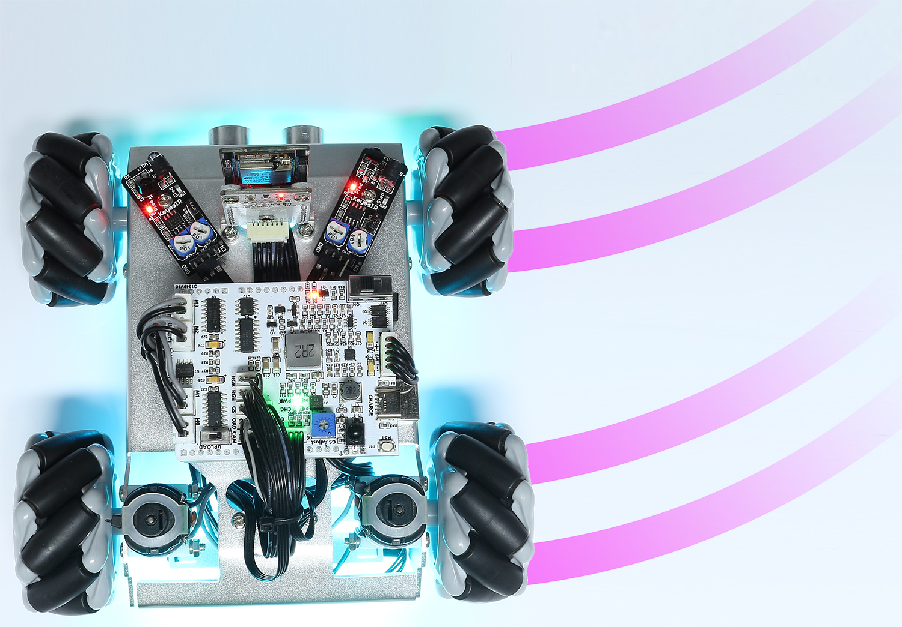
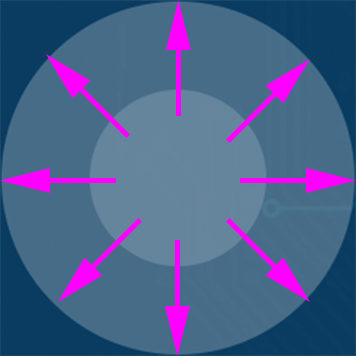
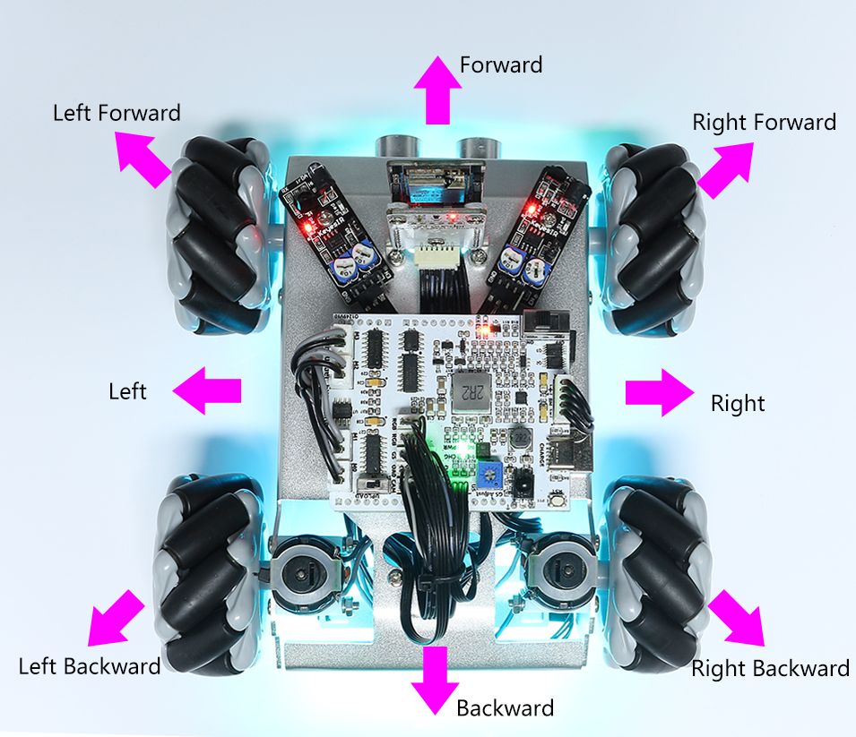
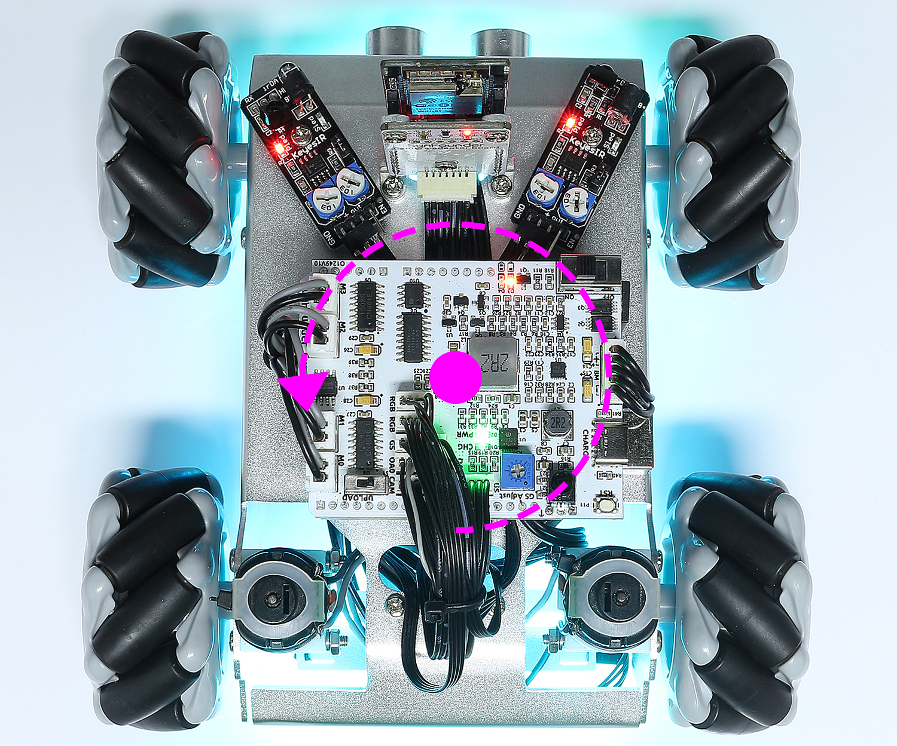

.. _ar_app_control_plus:

18. APP Control Plus
=====================

This project integrates Line Track, Follow, Avoid functions based on :ref:`ar_app_control`.

.. raw:: html

   <video loop autoplay muted style = "max-width:80%">
      <source src="../_static/video/app_control.mp4"  type="video/mp4">
      Your browser does not support the video tag.
   </video>

.. raw:: html
    
       

.. note::
    Please install `SunFounder Controller <https://docs.sunfounder.com/projects/sf-controller/en/latest/>`_ from **APP Store(iOS)** or **Google Play(Android)**.

**How to do?**

#. The ESP32-CAM and the Arduino board share the same RX (receive) and TX (transmit) pins. So, when you're uploading code, you'll need to first disconnect the ESP32-CAM to avoid any conflicts or potential issues.

    .. image:: ../img/unplug_cam.png
        :width: 400
        :align: center

#. Open the ``18_app_control_plus.ino`` file under the path of ``zeus-car-main\examples\18_app_control_plus``.

    .. raw:: html

        <iframe src=https://create.arduino.cc/editor/sunfounder01/b67e7245-369b-4218-b12c-d73f95ac3b22/preview?embed style="height:510px;width:100%;margin:10px 0" frameborder=0></iframe>

#. After the code is uploaded successfully, you can plug in the ESP32-CAM and then slide the power switch to ON to start the Zeus Car.

    .. image:: ../img/plug_esp32_cam.jpg
        :width: 300
        :align: center
        
#. Toggle the Upload Switch to the side of Run (right side on this diagram) to start the ESP32 CAM. 

    .. image:: ../img/zeus_run.jpg

#. Press the reset button to get the Arduino board's program running again.

    .. image:: ../img/zeus_reset_button.jpg

#. Connect to ``Zeus_Car`` WLAN.

    Now, connect your mobile device to the local area network (LAN) broadcast by the Zeus Car. This way, your mobile device and the Zeus Car will be on the same network, which will facilitate communication between the applications on your mobile device and the Zeus Car.
    

    * Find ``Zeus_Car`` on the WLAN of the mobile phone (tablet), enter the password ``12345678`` and connect to it.

    .. raw:: html

        

            <video center loop autoplay muted style = "max-width:80%">
                <source src="../_static/video/connect_wifi.mp4"  type="video/mp4">
                Your browser does not support the video tag.
            </video>
        

    .. raw:: html
        
         

    * The default connection mode is AP mode. So after you connect, there will be a prompt telling you that there is no Internet access on this WLAN network, please choose to continue connecting.

    .. image:: ../img/app_no_internet.png
        :width: 500
        :align: center

    .. raw:: html
        
           

#. Create a controller.

    * To add a controller on SunFounder Controller, click the **+** icon.

    .. image:: ../img/app1.png
        :width: 500
        :align: center

    .. raw:: html
        
           
    
    * Preset controllers are available for some products, here we choose **Zeus Car**. Give it a name, or simply tap **Confirm**.

    .. image:: ../img/app_preset.jpg
        :width: 500
        :align: center

    .. raw:: html
        
           
    
    
    * Once inside, the app will automatically search for the Zeus Car. After a moment, you will see a prompt saying "Connected Successfully."

    .. image:: ../img/app_edit.jpg
        :width: 500
        :align: center

    .. raw:: html
        
          

    * Now, tap the |app_run| button enables you to view the live video feed from the camera and control the car using the provided widgets. 
    
    .. image:: ../img/app_run123.png
        :width: 500
        :align: center

    .. raw:: html
        
           

#. Here are the functions of the widgets.

   * :ref:`app_compass_cali`: Turn on compass calibration.
   * **Stop(F)**: Stop all movements of the car.
   * **Reset Heading(G)**: After placing the car in one direction with your hand, click on this widget to make this direction as the front of the car movement. This allows you to quickly specify a direction instead of slowly rotating the car to that direction with other widgets.
   * :ref:`app_speech_control`: Switching to speech control mode.
   * :ref:`app_drift`: Activate the drift function.
   * :ref:`app_move`: Control the car to move in all directions.
   
   * :ref:`app_line_track`: The following two widgets can both switch to line track mode.
   
     * **Line no Mag(M)**: Switch to line track mode, but not affected by the magnetic field. During the line tracking process, the Zeus Car's orientation will continuously change.
     * **Line(N)**: Switching to line track mode, due to the presence of the magnetic field, the Zeus Car's orientation during line tracking will be oriented towards a specific direction.
   
   * :ref:`app_follow`: Switching to follow mode.
   * :ref:`app_avoid`: Switch to obstacle avoidance mode.
   * :ref:`app_rotate_drift`: Used to control the head direction.

.. _app_compass_cali:

Calibration(E)
--------------------------

Turn on compass calibration by clicking the |app_cali_e| button.

Place the Zeus car on the ground. Upon turning on the compass calibration, the car will start rotating counterclockwise and will stop in about 1 minute. If it rotates longer than 2 minutes, the magnetic field here is complicated. Try changing the location and calibrating again.

.. _app_drift:

Drift Enable(J)
---------------------

Click the |app_drift_j| button to enable the drift function.

* By sliding the |app_rotate_q| widget counterclockwise, you will see Zeus Car drift to the right. Upon releasing the hand, the car will stop at its current position.

.. image:: ../img/zeus_drift_left.jpg
    :width: 500
    :align: center

.. raw:: html
    
       
 
* Similarly, if you slide the |app_rotate_q| widget clockwise, the Zeus Car will drift to the left and stop in the current position.

.. raw:: html
    
       
 
.. _app_move:

Move in All Directions(K)
----------------------------------

.. raw:: html

   <video loop autoplay muted style = "max-width:80%">
      <source src="../_static/video/basic_movement.mp4"  type="video/mp4">
      Your browser does not support the video tag.
   </video>

.. raw:: html
    
         

The Zeus Car will move in the appropriate direction when you swipe the |app_move_k| widget.

.. raw:: html
    
       

The car moves once every time you slide, so if you don't release your hand all the time, the car keeps moving.

.. raw:: html
    
       
 
.. _app_speech_control:

Speech(I)
-------------------

By pressing the |app_speech_m| widget, you can activate the STT feature, where STT stands for Speech to Text. 

The SunFounder Controller app integrates with your mobile device's voice recognition engine. Hence, when you tap and hold the **Speech(I)** widget on the SunFounder Controller and speak into your mobile device.

Your device will capture your speech, convert it into text, and send it to the Zeus Car. If this text matches the pre-set commands in your code, the Car will carry out the corresponding actions.

The following are the commands currently preset in the code. Speak any of the following commands and observe how the Zeus Car responds.

* ``stop``: All movements of the car can be stopped.
* ``pasue``: The function is basically the same as Stop, but if the head of the car is not facing the direction originally set, it will slowly move to the set direction.
* ``forward``
* ``backward``
* ``left forward``
* ``left backward``
* ``right forward``
* ``right backward``
* ``move left``
* ``move right``

.. note::

    The STT (Speech to Text) function requires an internet connection and Google services on Android devices. However, this doesn't work with the pre-set AP (Access Point) mode on the Zeus Car.

    In AP mode, the Zeus Car creates a local Wi-Fi network that your mobile device can connect to, but it does not provide internet access.

    To use the STT function on Android, switch the car's code from AP to STA mode as outlined in :ref:`stt_android`.

.. note::

    iOS devices, using an offline voice recognition engine, work fine in both AP and STA modes.

After the car receives the above 8 commands, it will keep moving in the corresponding direction unless it receives ``stop`` or ``pasue`` commands.

* ``turn left``: This command will make the car to turn left 45° with the body as the center, then it will move forward or stop according to the previous state. If the previous state is stop, it will stop after turning left 45°; if it is forward, it will move forward after turning.

.. raw:: html
    
       
    
* ``turn right``: This command will make the car turn 45° to the right with the body as the center, and again will move forward or stop depending on the previous state.

.. image:: ../img/zeus_turn_right.jpg
    :width: 500
    :align: center

.. raw:: html
    
       
 
.. _app_line_track:

Line Track
--------------

.. raw:: html

   <video loop autoplay muted style = "max-width:80%">
      <source src="../_static/video/drift_based_line_following.mp4"  type="video/mp4">
      Your browser does not support the video tag.
   </video>

.. raw:: html
    
         

Click on the |app_line_n| widget to switch to the line track mode.

Two modes of line track are available on the Zeus Car, one with its head always facing the direction of movement and one with its head facing a fixed direction. Here, the second mode is selected.

#. Stick a 3cm wide line

    There are eight sensors on the Omni grayscale module, and the distance between each sensor is between 2 and 3 cm. There must be two sensors to detect the black line simultaneously. Therefore, the line you stick must be at least 3cm wide and the bend angle should not be less than 90°.

    .. image:: ../img/map.png
        :width: 500
        :align: center

    .. raw:: html
        
           
    
#. Calibrate the Omni Grayscale module.

    Since each subfloor has different grayscale values, the factory-set grayscale threshold may not be appropriate for your current environment, so you will need to calibrate this module before use. It is recommended that you need to calibrate it whenever the floor color changes a lot.

    * Place the Zeus Car on white surface and turn the potentiometer until the gray sensor light is just illuminated.

    .. image:: ../img/zeus_line_calibration.jpg
        :width: 500
        :align: center
    
    
    .. raw:: html
        
           
    
    * Now let the two greyscale sensors on the side be located just between the black line and white surface, and slowly turn the potentiometer until the signal indicator just goes off.

    .. image:: ../img/zeus_line_calibration1.jpg
        :width: 500
        :align: center

    .. raw:: html
        
           
    
    * You can move repeatedly over the the black line and white surface to make sure that the lights of the greyscale sensor are off when they are between the the black line and white surface and on when they are on the white surface, indicating that the module is successfully calibrated.

#. Place the Zeus Car on your stickied line, click the |app_line_n| widget, and it will track the line.

#. Due to the high environmental requirements of the Omni grayscale module, it is recommended to calibrate it a few more times if the tracking effect is not satisfactory (off-track).

.. _app_follow:

Follow(O)
------------

.. raw:: html

   <video loop autoplay muted style = "max-width:80%">
      <source src="../_static/video/object_following.mp4"  type="video/mp4">
      Your browser does not support the video tag.
   </video>

.. raw:: html
    
         

Click the |app_follow_o| widget to switch to follow mode.

The ultrasonic sensor detects obstacles in front (20 cm) and follows them forward. These two obstacle avoidance modules allow the car to follow left or right, but they need to be calibrated (15cm) before use.

#. Calibrate the IR obstacle avoidance module.

    * Start by adjusting the right obstacle avoidance module. During transportation, collisions may cause the transmitter and receiver on the infrared module to tilt. Therefore, you need to manually straighten them.

        .. raw:: html

            <video loop autoplay muted style = "max-width:80%">
                <source src="../_static/video/toggle_avoid.mp4"  type="video/mp4">
                Your browser does not support the video tag.
            </video>

        .. raw:: html
            
                 

    * Place an obstacle about 15cm away from the IR obstacle avoidance module.
    * On the module are two potentiometers, one to adjust the sending power and one to adjust the sending frequency. By adjusting these two potentiometers, you can adjust the detection distance.
    * Then you can adjust a potentiometer, and if at 15cm, the signal light on the module illuminates, the adjustment is successful; if it doesn't, adjust another potentiometer.

    .. image:: ../img/zeus_ir_avoid.jpg
        :width: 400
        :align: center

    .. raw:: html
        
           
    
    * Calibrate the other obstacle avoidance module in the same way.

#. Place Zeus car on a table or the ground and let it follow your hand or other obstacles.

.. _app_avoid:

Avoid(P)
------------------------

.. raw:: html

   <video loop autoplay muted style = "max-width:80%">
      <source src="../_static/video/obstacle_avoidance.mp4"  type="video/mp4">
      Your browser does not support the video tag.
   </video>

.. raw:: html
    
         

When you want to go into obstacle avoidance mode, click the |app_avoid_p| widget, but first reference the :ref:`app_follow` to calibrate the two obstacle avoidance modules.

* Zeus car will move forward.
* An ultrasonic module detects obstacles in front, if detected, the car turns left.
* When the left obstacle avoidance module detects an obstacle, the car turns right, and when the right obstacle avoidance module detects an obstacle, the car turns left.

.. _app_rotate_drift:

Control the Drection(Q)
-------------------------------

* When the |app_drift_j| button is on, the |app_rotate_q| widget is used to make the Zeus Car drift left and right.

* When the |app_drift_j| widget is off, the |app_rotate_q| widget is used to control the direction of the car's head.

    * By sliding the |app_rotate_q| widget counterclockwise, the car will also rotate counterclockwise. Upon releasing the hand, the head of the car will back to the original direction.

    .. image:: ../img/zeus_turn_left.jpg
        :width: 500
        :align: center

    .. raw:: html
        
           
    
    * Similarly the car will rotate clockwise with the |app_rotate_q| widget and return to the original direction when released.

    .. image:: ../img/zeus_turn_right.jpg
        :width: 500
        :align: center

    .. raw:: html
        
           