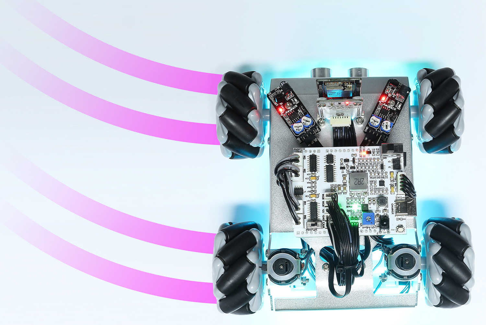

4. Drift
======================

In this project, you will learn how to make the Zeus Car drift.

**How to do?**

#. The ESP32-CAM and the Arduino board share the same RX (receive) and TX (transmit) pins. So, when you're uploading code, you'll need to first disconnect the ESP32-CAM to avoid any conflicts or potential issues.

    .. image:: ../img/unplug_cam.png
        :width: 400
        :align: center

#. Open the ``4_drift.ino`` file under the path of ``zeus-car-main\examples\4_drift``.

    .. raw:: html

        <iframe src=https://create.arduino.cc/editor/sunfounder01/9ca66dad-7258-4868-a8a4-3bd512bacd72/preview?embed style="height:510px;width:100%;margin:10px 0" frameborder=0></iframe>

#. After the code is uploaded successfully, slide the power switch to ON to start the Zeus Car.
#. Zeus Car will now move forward for 0.5 seconds, then drift 90 degrees left, and so forth. You can try changing 45 (rot) to another value or a negative number to see how the drift angle and direction change.

**How it works?**

The drift of the Zeus Car is achieved by adding the drift parameter ``drift`` to the move function ``carMove()``.

.. code-block::

    void carMove(int16_t angle, int8_t power, int8_t rot, bool drift)

* ``angle``: The direction you want the car to move. use the head of the car as the 0 degree and increase the angle in counterclockwise direction.
* ``power``: The moving power, the range is -100% ~ 100%. When ``power`` is positive, the car moves forward, and vice versa, it moves backward.
* ``rot``: Rotation power, the range is -100% ~ 100%. When ``rot`` is positive, the car turn counterclockwise, and vice versa.
* ``drift``: Default is false, when it is true, drift mode is enabled.

So the different ``power`` and ``rot`` values will change the drift angle and direction of the Zeus Car.