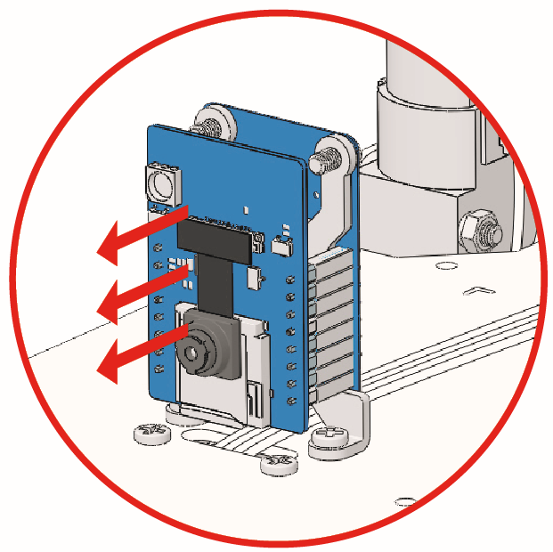

.. note::

    Hallo und willkommen in der SunFounder Raspberry Pi & Arduino & ESP32 Enthusiasten-Gemeinschaft auf Facebook! Tauchen Sie tiefer ein in die Welt von Raspberry Pi, Arduino und ESP32 mit anderen Enthusiasten.

    **Warum beitreten?**

    - **Expertenunterstützung**: Lösen Sie Nachverkaufsprobleme und technische Herausforderungen mit Hilfe unserer Gemeinschaft und unseres Teams.
    - **Lernen & Teilen**: Tauschen Sie Tipps und Anleitungen aus, um Ihre Fähigkeiten zu verbessern.
    - **Exklusive Vorschauen**: Erhalten Sie frühzeitigen Zugang zu neuen Produktankündigungen und exklusiven Einblicken.
    - **Spezialrabatte**: Genießen Sie exklusive Rabatte auf unsere neuesten Produkte.
    - **Festliche Aktionen und Gewinnspiele**: Nehmen Sie an Gewinnspielen und Feiertagsaktionen teil.

    👉 Sind Sie bereit, mit uns zu erkunden und zu erschaffen? Klicken Sie auf [|link_sf_facebook|] und treten Sie heute bei!

FAQ
================

Kompilierungsfehler: SoftPWM.h: Datei oder Verzeichnis nicht gefunden？
-----------------------------------------------------------------------------------------------------------------

Wenn die Meldung "Kompilierungsfehler: SoftPWM.h: Datei oder Verzeichnis nicht gefunden" erscheint, bedeutet dies, dass die ``SoftPWM`` Bibliothek nicht installiert ist.

Bitte beziehen Sie sich auf :ref:`ar_install_library`, um die beiden erforderlichen Bibliotheken ``SoftPWM`` und ``IRLremote`` zu installieren.

avrdude: stk500_getsync() Versuch 10 von 10: nicht synchronisiert: resp=0x6e?
--------------------------------------------------------------------------------------------

Wenn die folgende Meldung immer wieder erscheint, nachdem Sie auf den Hochladen-Button geklickt haben und das Board und den Port korrekt ausgewählt haben:

.. code-block::

    avrdude: stk500_recv(): Programmierer antwortet nicht
    avrdude: stk500_getsync() Versuch 1 von 10: nicht synchronisiert: resp=0x00
    avrdude: stk500_recv(): Programmierer antwortet nicht
    avrdude: stk500_getsync() Versuch 2 von 10: nicht synchronisiert: resp=0x00
    avrdude: stk500_recv(): Programmierer antwortet nicht
    avrdude: stk500_getsync() Versuch 3 von 10: nicht synchronisiert: resp=0x00

Zu diesem Zeitpunkt sollten Sie sicherstellen, dass die ESP32 CAM nicht angeschlossen ist.

Die ESP32-CAM und das Arduino-Board teilen sich die gleichen RX (Empfang) und TX (Senden) Pins. Deshalb sollten Sie die ESP32-CAM vor dem Hochladen des Codes trennen, um mögliche Konflikte oder Probleme zu vermeiden.

.. _stt_android:

Q3: Wie kann ich die STT-Funktion auf meinem Android-Gerät nutzen?
------------------------------------------------------------------------

Für die STT-Funktion muss das Android-Mobilgerät mit dem Internet verbunden sein und die **Google-Dienstkomponente** installiert haben.

Befolgen Sie nun die untenstehenden Schritte.

#. Ändern Sie den AP-Modus der Datei ``Zeus_Car.ino`` in den STA-Modus.

    * Öffnen Sie die Datei ``Zeus_Car.ino``, die sich im Verzeichnis ``zeus-car-main/Zeus_Car`` befindet.
    * Kommentieren Sie dann den mit dem AP-Modus verbundenen Code aus. Entfernen Sie die Kommentierung für den mit dem STA-Modus verbundenen Code und tragen Sie die ``SSID`` und das ``PASSWORT`` Ihres Heim-WLANs ein.

        .. code-block:: arduino

            /** Konfigurieren Sie den WLAN-Modus, SSID, Passwort */
            // #define WIFI_MODE WIFI_MODE_AP
            // #define SSID "Zeus_Car"
            // #define PASSWORD "12345678"

            #define WIFI_MODE WIFI_MODE_STA
            #define SSID "xxxxxxxxxx"
            #define PASSWORD "xxxxxxxxxx"

    * Speichern Sie diesen Code, wählen Sie das richtige Board (Arduino Uno) und den Port und klicken Sie dann auf die Schaltfläche **Hochladen**, um ihn auf das R3-Board hochzuladen.

#. Suchen Sie in Google Play nach ``google`` und installieren Sie die unten gezeigte App.

    .. image:: img/google_voice.png

#. Verbinden Sie Ihr Mobilgerät mit demselben WLAN, das Sie im Code eingetragen haben.

    .. image:: img/sta_wifi.png
        :width: 400
        :align: center

#. Öffnen Sie den zuvor in SunFounder Controller erstellten Controller und verbinden Sie ihn über die Schaltfläche |app_connect| mit dem ``Zeus_Car``.

    .. image:: img/app_connect.png
        :width: 500
        :align: center

#. Tippen und halten Sie das |app_speech_m| Widget gedrückt, nachdem Sie die Schaltfläche |app_run| angeklickt haben. Ein Hinweis wird angezeigt, dass zugehört wird. Sagen Sie den folgenden Befehl, um das Auto zu bewegen.

    * ``stop``: Alle Bewegungen des Autos können gestoppt werden.
    * ``pause``: Die Funktion ähnelt der von Stop, aber wenn die Vorderseite des Autos nicht in die ursprünglich eingestellte Richtung zeigt, wird es sich langsam in die eingestellte Richtung bewegen.
    * ``forward``
    * ``backward``
    * ``left forward``
    * ``left backward``
    * ``right forward``
    * ``right backward``
    * ``move left``
    * ``move right``
