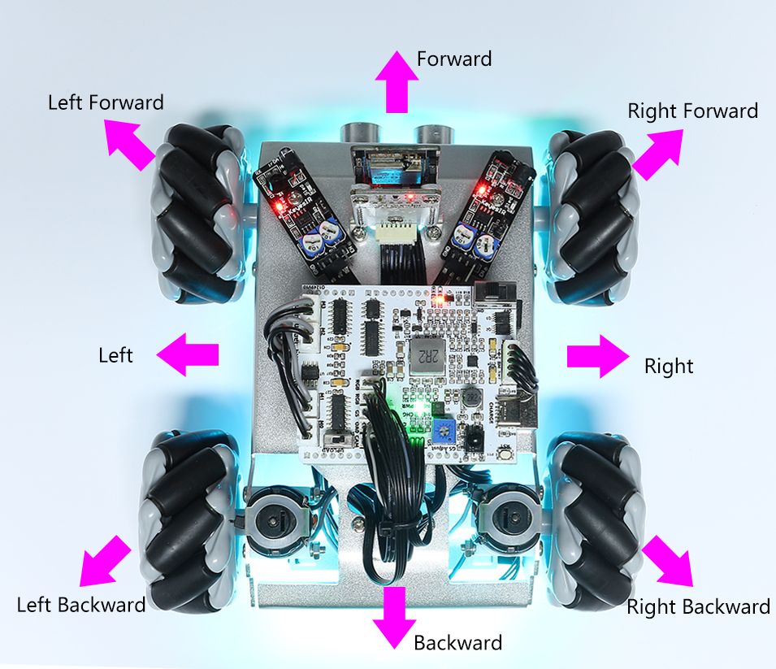

.. _play_app_control:

APPによる制御
=========================

Zeus Carをモバイルデバイスから制御するには、デバイスにAPP（SunFounder Controller）をダウンロードし、Zeus CarのLANに接続し、APP上で独自のコントローラーを作成する必要があります。

.. raw:: html

    

        <video center loop autoplay muted style = "max-width:70%">
            <source src="../_static/video/app_control.mp4"  type="video/mp4">
            Your browser does not support the video tag.
        </video>
    

速攻ガイド
---------------------

これは簡易チュートリアル動画です。まず動画をご覧いただき、以下の指示に従ってください。

.. raw:: html

    

        <video loop controls style = "max-width:90%">
            <source src="../_static/video/app_control_quick_guide.mp4"  type="video/mp4">
            ご使用のブラウザは動画タグをサポートしていません。
        </video>
    

.. raw:: html
    
       

#. Zeus Carの起動方法

    * 初回使用時やバッテリーケーブルを抜き差しした場合、Zeus Car Shieldは過放電保護回路を起動します。
    * そのため、Type-Cケーブルを約5秒間接続する必要があります。

    .. raw:: html

        

            <video center loop autoplay muted style = "max-width:70%">
                <source src="../_static/video/activate_battery.mp4"  type="video/mp4">
                ご使用のブラウザは動画タグをサポートしていません。
            </video>
        

    .. raw:: html
        
         

    * 電源インジケータが点灯した場合、保護状態が解除されたことを意味します。この時、バッテリーインジケータを確認してください。両方のインジケータが消灯していれば、Type-Cケーブルを続けて接続してバッテリーを充電してください。

    .. image:: img/zeus_power.jpg
        :width: 500
        :align: center

    .. raw:: html
        
           

    * 次に、車とESP32 CAM間の通信を確立するため、小さいスイッチを右にフリックします。その後、Resetボタンを押してコードを再起動します。その時点で、底部のライトがオレンジ色から薄青色に変わるのが観察できます。

    .. raw:: html

        

            <video center loop autoplay muted style = "max-width:70%">
                <source src="../_static/video/re_run_code.mp4"  type="video/mp4">
                ご使用のブラウザは動画タグをサポートしていません。
            </video>
        

    .. raw:: html
        
         

#. **APP Store(iOS)** または **Google Play(Android)** から `SunFounder Controller <https://docs.sunfounder.com/projects/sf-controller/en/latest/>`_ をインストールしてください。

#. ``Zeus_Car`` WLANに接続する。

    Zeus Carがブロードキャストするローカルエリアネットワーク(LAN)にモバイルデバイスを接続します。これにより、モバイルデバイスとZeus Carが同じネットワーク上になり、アプリケーション間の通信が容易になります。
    

    * 携帯電話(タブレット)のWLANで ``Zeus_Car`` を見つけ、パスワード ``12345678`` を入力して接続します。

    .. raw:: html

        

            <video center loop autoplay muted style = "max-width:80%">
                <source src="../_static/video/connect_wifi.mp4"  type="video/mp4">
                ご使用のブラウザは動画タグをサポートしていません。
            </video>
        

    .. raw:: html
        
         

    * デフォルトの接続モードはAPモードです。したがって、接続した後、このWLANネットワークにインターネット接続がないというプロンプトが表示されますが、接続を続行してください。

    .. image:: img/app_no_internet.png
        :width: 500
        :align: center

    .. raw:: html
        
           

#. コントローラの作成。

    * SunFounder Controllerでコントローラを追加するには、**+** アイコンをクリックしてください。

    .. image:: img/app1.png
        :width: 500
        :align: center

    .. raw:: html
        
           
    
    * 一部の製品にはプリセットのコントローラが用意されています。ここでは **Zeus Car** を選択してください。名前を付けるか、**Confirm** をタップしてください。

    .. image:: img/app_preset.jpg
        :width: 500
        :align: center

    .. raw:: html
        
           
    
    * アプリ内でZeus Carを自動的に検索します。少し待つと、「接続成功」というプロンプトが表示されます。

    .. image:: img/app_edit.jpg
        :width: 500
        :align: center

    .. raw:: html
        
          

    * 今度は、|app_run| ボタンをタップすると、カメラからのライブ映像を表示し、提供されているウィジェットを使用して車を操作できます。

    .. image:: img/app_run123.png
        :width: 500
        :align: center

    .. raw:: html
        
          

* 以下はウィジェットの機能一覧です。

        * :ref:`app_compass_cali`: コンパスのキャリブレーションを開始。
        * **Stop(F)**: 車の動きを全て停止。
        * **Reset Heading(G)**: 手で車を一つの方向に向けて配置した後、このウィジェットをクリックすることで、その方向を車の移動の前方として設定します。これにより、他のウィジェットで車をゆっくりその方向に回転させる代わりに、迅速に方向を指定できます。
        * :ref:`app_speech_control`: 音声制御モードに切り替え。
        * :ref:`app_drift`: ドリフト機能を有効にする。
        * :ref:`app_move`: 車を全方向に移動させるための制御。

        * :ref:`app_line_track`: 下記の2つのウィジェットは、ライントラックモードに切り替えることができます。
        
            * **Line no Mag(M)**: ライントラックモードに切り替えるが、磁場の影響を受けない。ライントラッキングの過程で、Zeus Carの方向は継続的に変わります。
            * **Line(N)**: ライントラックモードに切り替えると、磁場の存在のため、ライントラッキング中のZeus Carの方向は特定の方向に向けられます。

        * :ref:`app_follow`: フォローモードに切り替え。
        * :ref:`app_avoid`: 障害物回避モードに切り替え。
        * :ref:`app_rotate_drift`: 頭部の方向を制御するために使用。

.. _app_compass_cali:

Calibration(E)
--------------------------

|app_cali_e| ボタンをクリックしてコンパスのキャリブレーションをオンにします。

Zeusカーを地上に置きます。コンパスのキャリブレーションをオンにすると、車は反時計回りに回転を開始し、約1分で停止します。2分以上回転する場合は、こちらの磁場が複雑です。場所を変更して再度キャリブレーションしてください。

.. _app_drift:

Drift Enable(J)
---------------------

|app_drift_j| ボタンをクリックして、ドリフト機能を有効にします。

* |app_rotate_q| ウィジェットを反時計回りにスライドすると、Zeus Carが右にドリフトします。手を離すと、車は現在の位置で停止します。

    .. image:: img/zeus_drift_left.jpg
        :width: 500
        :align: center

* 同様に、 |app_rotate_q| ウィジェットを時計回りにスライドすると、Zeus Carは左にドリフトし、現在の位置で停止します。

    .. image:: img/zeus_drift_right.jpg
        :width: 500
        :align: center

.. _app_move:

Move in All Directions(K)
----------------------------------

.. raw:: html

   <video loop autoplay muted style = "max-width:80%">
      <source src="../_static/video/basic_movement.mp4"  type="video/mp4">
      Your browser does not support the video tag.
   </video>

.. raw:: html
    
         

|app_move_k| ウィジェットをスワイプすると、Zeus Carは適切な方向に移動します。

.. image:: img/joystick_move.png
    :align: center

一度スライドすると車が動きますので、常に手を離さない限り、車は移動し続けます。

.. _app_speech_control:

Speech(I)
-------------------

|app_speech_m| ウィジェットを押すことで、STT機能が有効になります。STTとは、Speech to Textの略です。

SunFounder Controllerアプリは、モバイルデバイスの音声認識エンジンと統合されています。したがって、SunFounder Controllerで **Speech(I)** ウィジェットをタップして長押しし、モバイルデバイスに向かって話すと、

デバイスはあなたの発話をキャプチャし、テキストに変換し、Zeus Carに送信します。このテキストがコード内の事前設定されたコマンドと一致する場合、車は対応するアクションを実行します。

以下は、コード内で現在プリセットされているコマンドです。次のコマンドのいずれかを話し、Zeus Carがどのように反応するかを観察してください。

* ``stop``: 車の動きをすべて停止できます。
* ``pasue``: この機能はStopと基本的に同じですが、車の頭部が元々設定された方向を向いていない場合、設定された方向にゆっくりと動きます。
* ``forward``
* ``backward``
* ``left forward``
* ``left backward``
* ``right forward``
* ``right backward``
* ``move left``
* ``move right``

.. note::

    STT（Speech to Text）機能を使用するには、Androidデバイスでのインターネット接続とGoogleサービスが必要です。しかし、Zeus Carの事前設定されたAP（Access Point）モードでは動作しません。

    APモードでは、Zeus Carはモバイルデバイスが接続できるローカルWi-Fiネットワークを作成しますが、インターネットアクセスは提供されません。

    AndroidでSTT機能を使用するには、:ref:`stt_android` に従って車のコードをAPモードからSTAモードに切り替えてください。

.. note::

    iOSデバイスは、オフラインの音声認識エンジンを使用しているため、APモードとSTAモードの両方で問題なく動作します。

上記の8つのコマンドを車が受信した後、 ``stop`` または ``pasue`` のコマンドを受信するまで、対応する方向に移動し続けます。

    .. image:: img/zeus_move.jpg

* ``turn left``: このコマンドを使用すると、車は本体を中心に45°左に回転し、前の状態に基づいて前進するか停止します。前の状態が停止の場合は、45°左に回転した後に停止します；前進の場合は、回転した後に前進します。

    .. image:: img/zeus_turn_left.jpg
        :width: 500
        :align: center

* ``turn right``: このコマンドを使用すると、車は本体を中心に45°右に回転し、前の状態によって前進するか停止します。

    .. image:: img/zeus_turn_right.jpg
        :width: 500
        :align: center

.. _app_line_track:

Line Track
--------------

.. raw:: html

   <video loop autoplay muted style = "max-width:80%">
      <source src="../_static/video/drift_based_line_following.mp4"  type="video/mp4">
      Your browser does not support the video tag.
   </video>

.. raw:: html

      

|app_line_n| ウィジェットをクリックしてライン追跡モードに切り替えます。

Zeus Carには、移動の方向を常に向いているモードと、頭が固定の方向を向いているモードの、2つのライン追跡モードがあります。ここでは、後者が選択されています。

1. 3cm幅のラインを貼る

    Omniグレースケールモジュールには8つのセンサーがあり、各センサー間の距離は2cmから3cmです。ブラックラインを同時に検出するためには、2つのセンサーが必要です。したがって、貼るラインは少なくとも3cmの幅が必要であり、曲がる角度は90°未満であってはなりません。

    .. image:: img/map.png
        :width: 500
        :align: center

2. Omniグレースケールモジュールをキャリブレートする。

    各サブフロアは異なるグレースケール値を持っているため、工場で設定された閾値は現在の環境に適していない場合があります。そのため、使用する前にこのモジュールをキャリブレートする必要があります。床の色が大きく変わった場合は、キャリブレーションを再度行うことを推奨します。

    * Zeus Carを白い表面に置き、灰色のセンサーの光がちょうど点灯するまでポテンショメーターを回します。

    .. image:: img/zeus_line_calibration.jpg
        :width: 500
        :align: center

    * それから、二つのグレースケールセンサーを、ブラックラインと白い表面の間にちょうど配置し、信号インジケータがちょうど消えるまでゆっくりとポテンショメーターを回します。

    .. image:: img/zeus_line_calibration1.jpg
        :width: 500
        :align: center
    
    * グレースケールセンサーの光が、ブラックラインと白い表面の間にあるときに消灯し、白い表面にあるときに点灯することを確認するために、ブラックラインと白い表面の上を何度も動かすことができます。これは、モジュールが正常にキャリブレーションされたことを示しています。

3. Zeus Carを貼ったラインの上に置き、 |app_line_n| ウィジェットをクリックすると、ラインを追跡します。

4. Omniグレースケールモジュールの環境要件が高いため、追跡効果が満足できない場合（脱線）は、何度もキャリブレートすることを推奨します。

.. _app_follow:

Follow(O)
------------
.. raw:: html

   <video loop autoplay muted style = "max-width:80%">
      <source src="../_static/video/object_following.mp4"  type="video/mp4">
      Your browser does not support the video tag.
   </video>

.. raw:: html

      

|app_follow_o| ウィジェットをクリックして、フォローモードに切り替えます。

超音波センサーは前方（20 cm）の障害物を検出し、それらを追尾します。これら二つの障害物回避モジュールは車が左または右に追尾することを可能にしますが、使用前に（15cm）でキャリブレートする必要があります。

1. IR障害物回避モジュールをキャリブレートする。

    * 右の障害物回避モジュールの調整から始めます。輸送中の衝突により、赤外線モジュールの送信機と受信機が傾くことがあります。したがって、手動でそれらをまっすぐに調整する必要があります。

    .. raw:: html

        <video loop autoplay muted style = "max-width:80%">
           <source src="../_static/video/toggle_avoid.mp4"  type="video/mp4">
           Your browser does not support the video tag.
        </video>

    .. raw:: html

          

    * IR障害物回避モジュールから約15cm離れた場所に障害物を置きます。
    * モジュールには2つのポテンショメータがあります。一つは送信電力を調整するためのもの、もう一つは送信周波数を調整するためのものです。これらのポテンショメータを調整することで、検出距離を調整することができます。
    * その後、ポテンショメータを調整し、15cmでモジュールの信号灯が点灯する場合は調整が成功していると言えます。そうでない場合は、もう一つのポテンショメータを調整します。

        .. image:: img/zeus_ir_avoid.jpg
            :width: 500
            :align: center

    * 同じ方法で他の障害物回避モジュールをキャリブレートします。

2. Zeus車をテーブルや地面に置き、あなたの手や他の障害物を追跡させます。

.. _app_avoid:

Avoid(P)
------------------------

.. raw:: html

   <video loop autoplay muted style = "max-width:80%">
      <source src="../_static/video/obstacle_avoidance.mp4"  type="video/mp4">
      Your browser does not support the video tag.
   </video>

.. raw:: html

      

障害物回避モードに入る場合は、 |app_avoid_p| ウィジェットをクリックしてください。ただし、2つの障害物回避モジュールをキャリブレートする前に、:ref:`app_follow` を参照してください。

* Zeus車は前進します。
* 超音波モジュールは前方の障害物を検出します。検出された場合、車は左に回転します。
* 左の障害物回避モジュールが障害物を検出すると、車は右に回転し、右の障害物回避モジュールが障害物を検出すると、車は左に回転します。

.. _app_rotate_drift:

Control the Drection(Q)
-------------------------------

* |app_drift_j| ボタンがオンの場合、 |app_rotate_q| ウィジェットはZeus Carを左右にドリフトさせるために使用されます。

* |app_drift_j| ウィジェットがオフの場合、 |app_rotate_q| ウィジェットは車の頭の方向を制御するために使用されます。

    * |app_rotate_q| ウィジェットを反時計回りにスライドすると、車も反時計回りに回転します。手を離すと、車の頭は元の方向に戻ります。

    .. image:: img/zeus_turn_left.jpg
        :width: 500
        :align: center

    * 同様に、 |app_rotate_q| ウィジェットで車は時計回りに回転し、手を放すと元の方向に戻ります。

    .. image:: img/zeus_turn_right.jpg
        :width: 500
        :align: center

