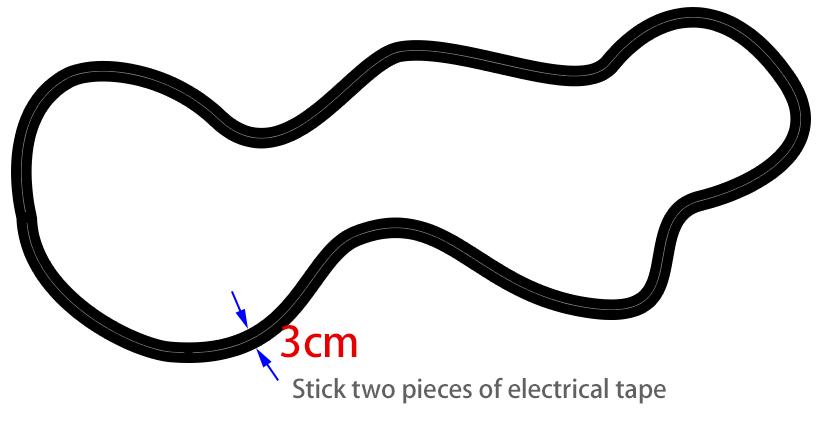

.. note:: 

    Bonjour et bienvenue dans la communauté des passionnés de SunFounder Raspberry Pi, Arduino et ESP32 sur Facebook ! Plongez dans l’univers de Raspberry Pi, Arduino et ESP32 avec d’autres passionnés et approfondissez vos connaissances.

    **Pourquoi nous rejoindre ?**

    - **Support d'experts** : Bénéficiez de l’aide de notre communauté et de notre équipe pour résoudre les problèmes après-vente et relever les défis techniques.
    - **Apprentissage et partage** : Échangez des conseils et des tutoriels pour perfectionner vos compétences.
    - **Aperçus exclusifs** : Accédez en avant-première aux annonces de nouveaux produits et aux exclusivités.
    - **Réductions spéciales** : Profitez d’offres exclusives sur nos dernières innovations.
    - **Promotions et cadeaux festifs** : Participez à des concours et à des offres promotionnelles saisonnières.

    👉 Prêt à explorer et à créer avec nous ? Cliquez sur [|link_sf_facebook|] et rejoignez-nous dès aujourd’hui !

.. _ar_line_track:

14. Suivi de ligne
=====================

Dans ce projet, vous apprendrez à utiliser le module Omni Grayscale pour le suivi de ligne.

Avant de commencer, vous devez utiliser du ruban électrique noir pour tracer une ligne de suivi, qui peut être un cercle, une ligne droite ou une forme irrégulière.

Mais il y a deux points à prendre en compte.

1. Cette ligne doit avoir une largeur de 3 cm (l'épaisseur d'un ruban électrique est de 1,5 cm).
2. L'angle des courbes ne doit pas être inférieur à 90°.

**Comment procéder ?**

#. La ESP32-CAM et la carte Arduino partagent les mêmes broches RX (réception) et TX (transmission). Par conséquent, lorsque vous téléversez du code, vous devez d'abord déconnecter la ESP32-CAM pour éviter tout conflit ou problème potentiel.

    .. image:: img/unplug_cam.png
        :width: 400
        :align: center

#. Ouvrez le fichier ``14_line_track.ino`` sous le chemin ``zeus-car-main\examples\14_line_track``.

    .. raw:: html

        <iframe src=https://create.arduino.cc/editor/sunfounder01/f1bfb9ad-8bfa-417e-a4c0-10dbdcdc4298/preview?embed style="height:510px;width:100%;margin:10px 0" frameborder=0></iframe>

#. Une fois le code téléversé avec succès, mettez l'interrupteur d’alimentation sur ON pour démarrer le Zeus Car.

#. Ensuite, votre Zeus Car suivra la ligne tracée. S'il sort de la trajectoire, cela peut signifier que vous devez recalibrer le :ref:`ar_grayscale`, ou réduire sa vitesse.
