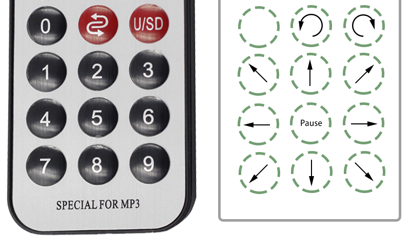

5. Remote Control
======================

In this project, you will learn how to control the Zeus Car with the remote control.

**How to do?**

#. First check that the **Upload** button is toggled to the side near the motor port.

#. Open the ``5_remote_control.ino`` file under the path of ``zeus-car-main\examples\5_remote_control``.

    .. raw:: html

        <iframe src=https://create.arduino.cc/editor/sunfounder01/8e74cf1b-9100-4e4d-ab63-f21ae40232a5/preview?embed style="height:510px;width:100%;margin:10px 0" frameborder=0></iframe>

#. After the code is uploaded successfully, turn the power switch to ON to start the Zeus Car. 

#. Then use the 1~9 on the remote control to control the car in 8 directions. After pressing a key, the Zeus Car will keep moving until you press |ir_power| or the number key 5.

    .. image:: img/zeus_move.jpg
        :width: 600
        :align: center

#. When you press |ir_return| once, the car will rotate counterclockwise with the body as the center and will stop until you press |ir_power| or the number key 5.

    .. image:: img/zeus_turn_left.jpg
        :width: 600
        :align: center

#. Similarly, pressing |ir_usd| once will make the car rotate clockwise, and then it will stop until you press |ir_power| or the number key 5.

    .. image:: img/zeus_turn_right.jpg
        :width: 600
        :align: center 