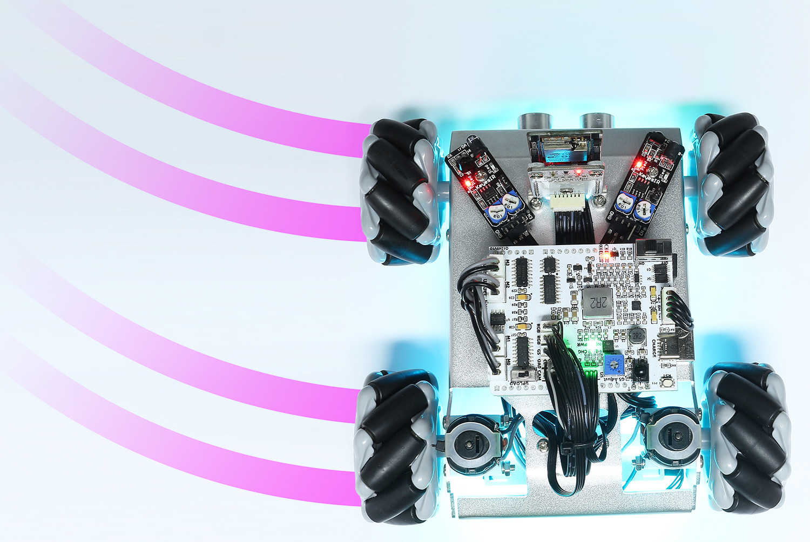
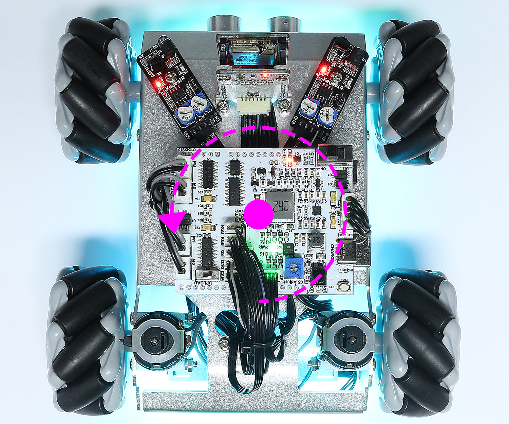
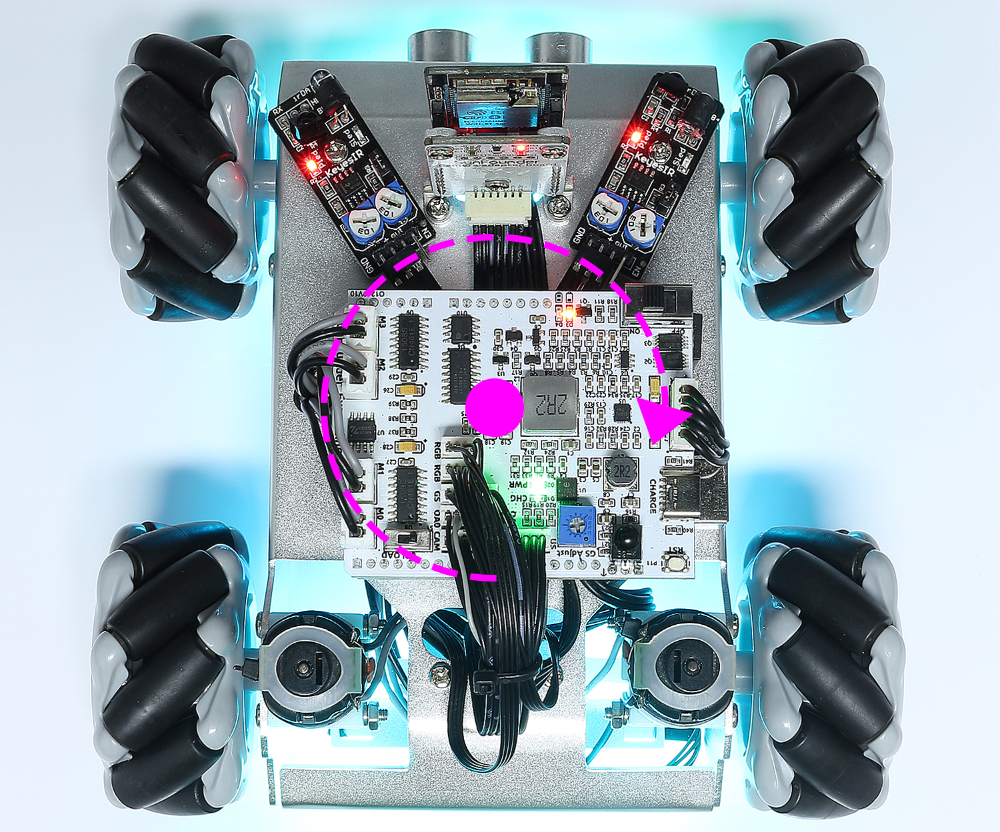

.. _play_remote_control:

Control by Remote
==========================

Zeus Car can be controlled with a remote control by turning the car on then pressing the buttons on the remote control directly. This method is stable and less susceptible to outside interference, but the control may not be as flexible.

Quick Guide
--------------------

This is a quick tutorial video. Please watch the video first, and then follow the instructions provided below.

.. raw:: html

   <video loop controls style = "max-width:90%">
      <source src="../_static/video/ir_control_quick_guide.mp4"  type="video/mp4">
      Your browser does not support the video tag.
   </video>

.. raw:: html
    
         

#. Let's start the Zeus Car.

    * When first used or when the battery cable is unplugged, Zeus Car Shield will activate its over-discharge protection circuitry.
    * So you'll need to plug in the Type-C cable for about 5 seconds.

    .. raw:: html

        

            <video center loop autoplay muted style = "max-width:70%">
                <source src="../_static/video/activate_battery.mp4"  type="video/mp4">
                Your browser does not support the video tag.
            </video>
        

    .. raw:: html
        
         

    
    * If the power indicator lights up, it means that the protection status has been released. At this time look at the battery indicators, if both battery indicators are off, please continue to plug in the Type-C cable to charge the battery.

    .. image:: img/zeus_power.jpg
        :width: 500
        :align: center

    .. raw:: html
        
           
    
    * Now, you'll need to flick the smaller switch to the right to establish communication between the car and the ESP32 CAM. Afterward, press the Reset button to reboot the code. At this point, you'll observe the undercarriage lights transition from orange to a light blue.

    .. raw:: html

        

            <video center loop autoplay muted style = "max-width:70%">
                <source src="../_static/video/re_run_code.mp4"  type="video/mp4">
                Your browser does not support the video tag.
            </video>
        

    .. raw:: html
        
         

#. Press the different keys on the remote control to control the car.

    .. image:: img/remote_control.jpg
        :width: 500
        :align: center

    .. raw:: html
        
         

    * **Stop**: Stop all movements of the car.
    * :ref:`ir_compass_cali`: Turn on compass calibration.
    * :ref:`ir_line_track`：Switching to line track mode.
    * :ref:`ir_follow`：Switching to follow mode.
    * :ref:`ir_avoid`：Switch to obstacle avoidance mode.
    * :ref:`drift`: Drift to the left/right.
    * **Set Heading**：After placing the car in one direction with your hand, click on this key to make this direction as the front of the car movement. This allows you to quickly specify a direction instead of slowly rotating the car to that direction with other keys.
    * :ref:`rotate_left/right`: Turn left/right
    * :ref:`ir_move`：Control the car to move in all directions.
    * **Pause**：The function is basically the same as Stop, but if the head of the car is not facing the direction originally set, it will slowly move to the set direction.

.. _ir_compass_cali:

Compass Calibration
-----------------------------------

Turn on compass calibration by pressing the |ir_mute| key.

Place the Zeus car on the ground. Upon turning on the compass calibration, the car will start rotating counterclockwise and will stop in about 1 minute. If it rotates longer than 2 minutes, the magnetic field here is complicated. Try changing the location and calibrating again.

.. _ir_line_track:

Line Track
---------------------------

.. raw:: html

   <video loop autoplay muted style = "max-width:80%">
      <source src="../_static/video/drift_based_line_following.mp4"  type="video/mp4">
      Your browser does not support the video tag.
   </video>

.. raw:: html
    
         

Press the |ir_play| key to switch to the line track mode.

Two modes of line track are available on the Zeus Car, one with its head always facing the direction of movement and one with its head facing a fixed direction. Here, the second mode is selected.

But before you can get it to follow the line, you need to calibrate the Omni Grayscale module and stick the line, as follows.

#. Stick a 3cm wide line

    There are eight sensors on the Omni grayscale module, and the distance between each sensor is between 2 and 3 cm. There must be two sensors to detect the black line simultaneously. Therefore, the line you stick must be at least 3cm wide and the bend angle should not be less than 90°.

    .. image:: img/map.png
        :width: 500
        :align: center

    .. raw:: html
        
         

#. Calibrate the Omni Grayscale module.

    Since each subfloor has different grayscale values, the factory-set grayscale threshold may not be appropriate for your current environment, so you will need to calibrate this module before use. It is recommended that you need to calibrate it whenever the floor color changes a lot.

    * Place the Zeus Car on white surface and turn the potentiometer until the gray sensor light is just illuminated.

    .. image:: img/zeus_line_calibration.jpg
        :width: 500
        :align: center

    .. raw:: html
        
         

    * Now let the two greyscale sensors on the side be located just between the black line and white surface, and slowly turn the potentiometer until the signal indicator just goes off.

    .. image:: img/zeus_line_calibration1.jpg
        :width: 500
        :align: center

    .. raw:: html
        
         

    * You can move repeatedly over the the black line and white surface to make sure that the lights of the greyscale sensor are off when they are between the the black line and white surface and on when they are on the white surface, indicating that the module is successfully calibrated.

#. Place the Zeus Car on your stickied line, press the |ir_play| key, and it will track the line.

#. Due to the high environmental requirements of the Omni grayscale module, it is recommended to calibrate it a few more times if the tracking effect is not satisfactory (off-track).

.. _ir_follow:

Follow
---------------------------

.. raw:: html

   <video loop autoplay muted style = "max-width:80%">
      <source src="../_static/video/object_following.mp4"  type="video/mp4">
      Your browser does not support the video tag.
   </video>

.. raw:: html
    
         

Press the |ir_backward| key to switch to follow mode.

The ultrasonic sensor detects obstacles in front (20 cm) and follows them forward. These two obstacle avoidance modules allow the car to follow left or right, but they need to be calibrated (15cm) before use.

#. Calibrate the IR obstacle avoidance module.

    * Start by adjusting the right obstacle avoidance module. During transportation, collisions may cause the transmitter and receiver on the infrared module to tilt. Therefore, you need to manually straighten them.

            .. raw:: html

                <video loop autoplay muted style = "max-width:80%">
                    <source src="../_static/video/toggle_avoid.mp4"  type="video/mp4">
                    Your browser does not support the video tag.
                </video>

            .. raw:: html
                
                     

    * Place an obstacle about 15cm away from the IR obstacle avoidance module.
    * On the module are two potentiometers, one to adjust the sending power and one to adjust the sending frequency. By adjusting these two potentiometers, you can adjust the detection distance.
    * Then you can adjust a potentiometer, and if at 15cm, the signal light on the module illuminates, the adjustment is successful; if it doesn't, adjust another potentiometer.

    .. image:: img/zeus_ir_avoid.jpg
        :width: 500
        :align: center

    .. raw:: html
        
         

    * Calibrate the other obstacle avoidance module in the same way.

#. Place Zeus car on a table or the ground and let it follow your hand or other obstacles.

.. _ir_avoid:

Obstacle Avoidance
--------------------------------------

.. raw:: html

   <video loop autoplay muted style = "max-width:80%">
      <source src="../_static/video/obstacle_avoidance.mp4"  type="video/mp4">
      Your browser does not support the video tag.
   </video>

.. raw:: html
    
         

When you want to go into obstacle avoidance mode, press the |ir_forward| key, but first reference the :ref:`ir_follow` to calibrate the two obstacle avoidance modules.

* Zeus car will move forward.
* An ultrasonic module detects obstacles in front, if detected, the car turns left.
* When the left obstacle avoidance module detects an obstacle, the car turns right, and when the right obstacle avoidance module detects an obstacle, the car turns left.

.. _drift:

Drift Left/Right
-------------------------------------------------

Use the |ir_minus| and |ir_plus| keys to drift the car to the left/right.

* Press the |ir_minus| key, the car will drift to the left.

.. raw:: html
    
     

* Press the |ir_plus| key, the car will drift to the right.

.. image:: img/zeus_drift_right.jpg
    :width: 500
    :align: center

.. raw:: html
    
     

* If it was stopped before drifting, pressing the |ir_minus| or |ir_plus| key once will cause the Zeus to drift 90° to the left or right.
* If it was moving before drifting, after pressing the key, the Zeus Car will drift 90° to the left or right, then pan until you press another key.

.. _ir_move:

Move in All Directions(1 ~ 9)
-------------------------------------

.. raw:: html

   <video loop autoplay muted style = "max-width:80%">
      <source src="../_static/video/basic_movement.mp4"  type="video/mp4">
      Your browser does not support the video tag.
   </video>

.. raw:: html
    
         

Use the number keys 1~9 to make the Zeus Car move in 8 directions.

.. image:: img/remote_control_move.jpg
    :width: 500
    :align: center

.. raw:: html
    
     

.. _rotate_left/right:

Rotate Left/Right（Cycle/USD Key）
-----------------------------------------

* The car will turn 45° left with the body as the center if you press |ir_return| once. Depending on the previous state, it will move forward or stop. If the previous state is stop, it will stop after 45° left turn; if it is forward, it will move forward after the left turn.

.. raw:: html
    
     

* Similarly, pressing |ir_usd| once will make the car turn 45° to the right, and then it will move forward or stop depending on the previous state.

.. raw:: html
    
     

