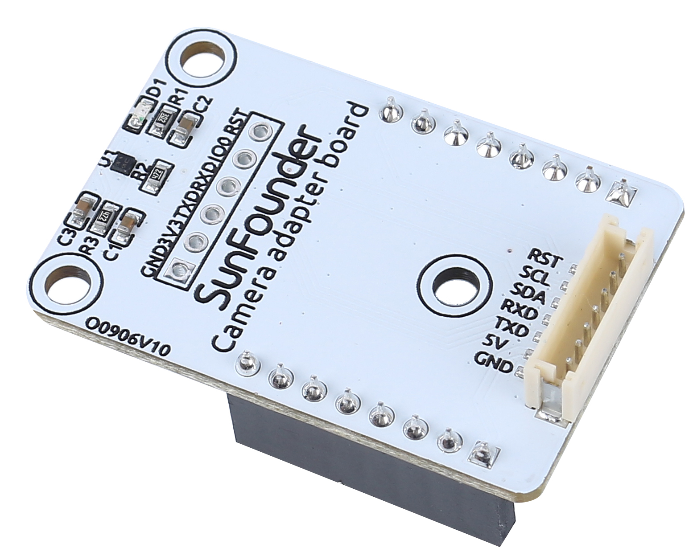

.. note::

    Hello, welcome to the SunFounder Raspberry Pi & Arduino & ESP32 Enthusiasts Community on Facebook! Dive deeper into Raspberry Pi, Arduino, and ESP32 with fellow enthusiasts.

    **Why Join?**

    - **Expert Support**: Solve post-sale issues and technical challenges with help from our community and team.
    - **Learn & Share**: Exchange tips and tutorials to enhance your skills.
    - **Exclusive Previews**: Get early access to new product announcements and sneak peeks.
    - **Special Discounts**: Enjoy exclusive discounts on our newest products.
    - **Festive Promotions and Giveaways**: Take part in giveaways and holiday promotions.

    👉 Ready to explore and create with us? Click [|link_sf_facebook|] and join today!

Camera Adapter Board
=====================

* **RST**: Used to reset the ESP32-CAM.
* **SCL**: Serial data pin for QMC6310
* **SDA**: Serial clock pin of the QMC6310
* **RXD**: The RXD of ESP32-CAM, you need to upload code to ESP32-CAM through these two serial pins, RXD and TXD.
* **TXD**: TXD of ESP32-CAM
* **5V**: 5V DC Supply Input
* **GND**: Ground Input

The Camera Adapter Board, as the name implies, is an expansion board for the ESP-32 CAM, used to expand the ESP32-CAM so that it can be secured to the robot, and can be easily wired.

.. image:: img/cam_adapter_esp32cam.png
    :width: 400
    :align: center

Also because the geomagnetic chip QMC6310 is susceptible to interference from motors, we put it on this camera adapter board to keep it as far away from the motors as possible.

.. image:: img/cam_adapter_qmc6310.png
    :width: 400
    :align: center

**Features**

* Working voltage: 5V
* Interface Model: ZH1.5, 7P
* Dimension: 40mm x 27mm x 15mm
* Communication protocol: UART and I2C

**Documents**

* PCB

.. image:: img/cam_adap_pcb_bottom.png
    :width: 300

.. image:: img/cam_adap_pcb_top.png
    :width: 300

* Schematic

.. image:: img/cam_adapter_sche.png

**About QMC6310**

The QMC6310 is a three-axis magnetic sensor, which integrates magnetic sensors and signal condition ASIC into one silicon chip. This Land Grid Array package (LGA) is targeted for applications such as e-compass, map rotation, gaming and personal navigation in mobile and wearable devices. 

The QMC6310 is based on state-of-the-art, high resolution, magneto-resistive technology. Along with the custom-designed 16-bit ADC ASIC, it offers the advantages of low noise, high accuracy, low power consumption, offset cancellation and temperature compensations. QMC6310 enables 1° to 2° compass heading accuracy. The I²C serial bus allows for easy interface. 

The QMC6310 is in a 1.2x1.2x0.53mm3 surface mount 8-pin LGA package.

* |link_qmc6310_datasheet|