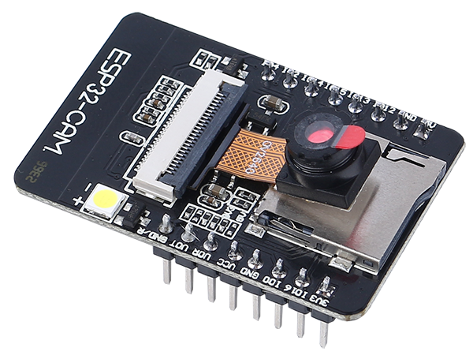
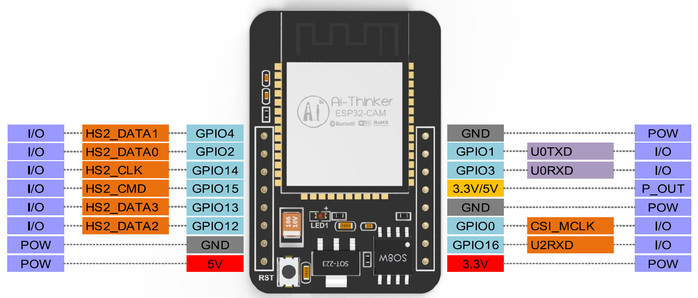

ESP32 CAM
=================

The ESP32-CAM is a very small camera module with the ESP32-S chip that costs approximately $10. Besides the OV2640 camera, and several GPIOs to connect peripherals, it also features a microSD card slot that can be useful to store images taken with the camera or to store files to serve to clients.

The module can work independently as the smallest system, with a size of only 27*40.5*4.5mm, and a deep sleep current as low as 6mA.

ESP32-CAM can be widely used in various IoT applications, suitable for home smart devices, industrial wireless control, wireless monitoring, QR wireless identification, wireless positioning system signals and other IoT applications. It is an ideal solution for IoT applications.

**Technical Specifications**

.. list-table::
    :widths: 25 50

    * - Module Model
      - ESP32-CAM
    * - Package
      - DIP-16
    * - Size
      - 27*40.5*4.5（±0.2）mm
    * - SPI Flash
      - default 32Mbit
    * - RAM
      - Internal 520KB + External 8MB PSRAM
    * - Bluetooth
      - Bluetooth 4.2 BR/EDR and BLE standards
    * - Wi-Fi
      - 802.11 b/g/n/e/i
    * - Support Interfaces
      - UART、SPI、I2C、PWM
    * - Support TF Card
      - up to 4G
    * - IO Pins
      -  9
    * - Serial Port Speed
      - default 115200 bps
    * - Image Output Format
      - JPEG(only OV2640 support),BMP,GRAYSCALE
    * - Spectrum range
      - 2400 ~2483.5MHz
    * - Antenna Type
      - On-board PCB antenna, gain 2dBi
    * - Transmit Power
      - 802.11b\: 17±2 dBm (@11Mbps) 
    * - 
      - 802.11g\: 14±2 dBm (@54Mbps) 
    * - 
      - 802.11n\: 13±2 dBm (@MCS7)
    * - Receive Sensitivity
      - CCK, 1 Mbps\: -90dBm, 
    * - 
      - CCK, 11 Mbps\: -85 dBm
    * - 
      - 6 Mbps (1/2 BPSK)\: -88 dBm
    * - 
      - 54 Mbps (3/4 64-QAM)\: -70dBm
    * - 
      - MCS7 (65 Mbps, 72.2 Mbps)\: -67dBm
    * - Power Consumption
      - Flash off\: 180mA\@5V, 
    * - 
      - Flash on and brightness to maximum\: 310mA\@5V
    * - 
      - Deep-sleep\: the lowest power consumption can reach 6mA\@5V
    * - 
      - Moderm-sleep\: minimum 20mA\@5V
    * - 
      - Light-sleep\: minimum 6.7mA\@5V
    * - Security
      - WPA/WPA2/WPA2-Enterprise/WPS
    * - Power supply range
      - 4.75-5.25V
    * - Operating Temperature
      - -20 ℃ ~ 70 ℃
    * - Storage Environment
      - -40 ℃ ~ 125 ℃ , < 90%RH

**ESP32-CAM Pinout**

The following figure shows the ESP32-CAM pinout (AI-Thinker module).

* There are three **GND** pins and three pins for power: 3.3V, 5V and either 3.3V or 5V.
* **GPIO 1** and **GPIO 3** are the serial pins. You need these pins to upload code to your board. 
* Additionally, **GPIO 0** also plays an important role, since it determines whether the ESP32 is in flashing mode or not. When **GPIO 0** is connected to **GND**, the ESP32 is in flashing mode.

* The following pins are internally connected to the microSD card reader:

* GPIO 14: CLK
* GPIO 15: CMD
* GPIO 2: Data 0
* GPIO 4: Data 1 (also connected to the on-board LED)
* GPIO 12: Data 2
* GPIO 13: Data 3

**Note**

* Please make sure that the input power of the module is at least 5V 2A, otherwise the picture may have water lines.
* The ESP32 GPIO32 pin controls the camera power. When the camera is working, please pull GPIO32 low.
* Since GPIO0 is connected to the camera XCLK, please leave GPIO0 in the air when using it, and do not connect it to high or low level.
* The default firmware is already included in the factory, and no additional download is provided. Please be careful if you need to re-burn other firmware.

**Document**

* Schematic diagram: |link_esp32cam_schematic|
* Camera specification (English version): |link_cam_ov2640|

.. note::
    All information above comes from |link_aithiner|