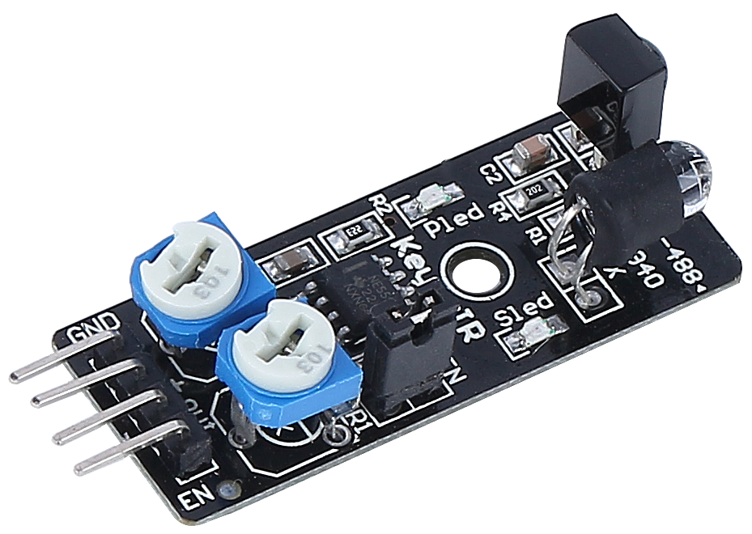
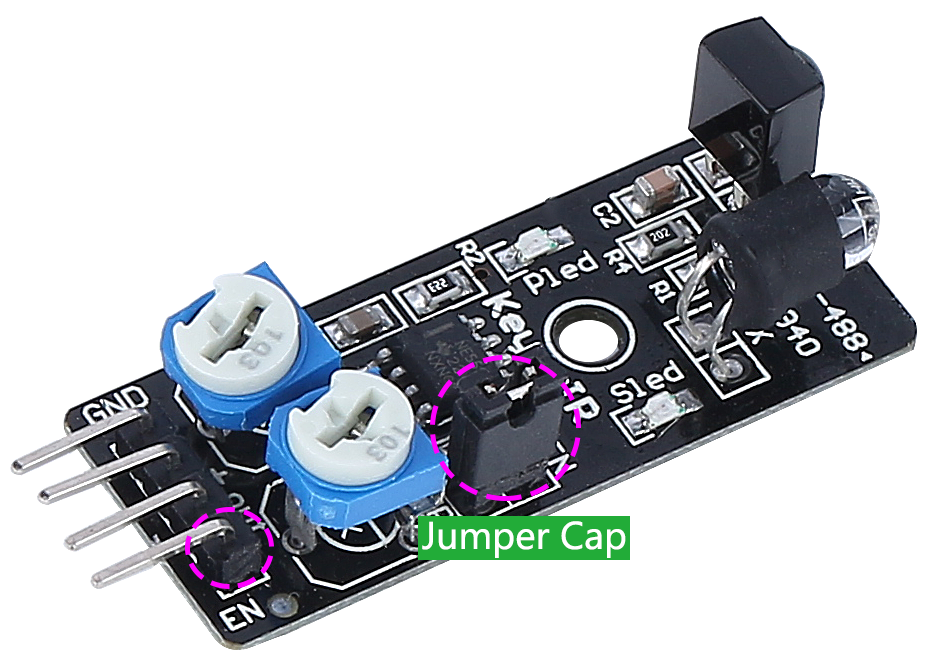

.. note::

    ¡Hola! Bienvenido a la comunidad de entusiastas de SunFounder Raspberry Pi, Arduino y ESP32 en Facebook. Únete a nosotros y sumérgete en el fascinante mundo de Raspberry Pi, Arduino y ESP32 junto con otros apasionados.

    **Why Join?**

    - **Expert Support**: Resuelve problemas postventa y supera desafíos técnicos con la ayuda de nuestra comunidad y equipo.
    - **Learn & Share**: Intercambia consejos y tutoriales para mejorar tus habilidades.
    - **Exclusive Previews**: Sé el primero en conocer los anuncios de nuevos productos y obtener adelantos exclusivos.
    - **Special Discounts**: Disfruta de descuentos exclusivos en nuestros productos más recientes.
    - **Festive Promotions and Giveaways**: Participa en sorteos y promociones especiales durante las festividades.

    👉 ¿Listo para explorar y crear con nosotros? Haz clic en [|link_sf_facebook|] y únete hoy mismo.

Módulo de evitación de obstáculos por infrarrojos (IR)
===========================================================

* **GND**: Conexión a tierra.
* **+**: Entrada de alimentación de 3.3V a 5V DC.
* **Out**: Pin de salida de señal. Por defecto, se encuentra en alto y cambia a bajo cuando se detecta un obstáculo.
* **EN**: Pin de habilitación del módulo. Cuando está en nivel bajo, el módulo está activado. Por defecto, está conectado a GND mediante un puente de conexión.

Este es un módulo común de evitación de obstáculos por infrarrojos, que utiliza un par de componentes emisores y receptores de IR. Básicamente, el emisor emite luz infrarroja, y cuando un obstáculo se encuentra en la dirección de detección, la luz infrarroja se refleja y es captada por el receptor. En ese momento, el indicador LED se enciende y, tras el procesamiento del circuito, se genera una señal de salida en nivel bajo.

El módulo tiene un rango de detección de 2 a 40 cm, con una excelente capacidad de resistencia a interferencias. Como la reflectividad varía según el color del objeto detectado, los objetos más oscuros (cercanos al negro) reducen la distancia de detección. En una pared blanca, el rango efectivo de detección es de **2 a 30 cm**.

Cuando el pin de habilitación (EN) está en bajo, el módulo está operativo. Si el puente de conexión está insertado, el pin EN queda conectado a GND y el módulo permanecerá siempre activo. Para controlar el **EN** mediante código, es necesario retirar el puente de conexión.

**Ajuste de la distancia de detección**

Debido a las variaciones en las condiciones de iluminación, la distancia de detección preconfigurada de fábrica puede no ser adecuada para todos los entornos, por lo que se recomienda ajustarla antes de su uso.

El módulo cuenta con dos potenciómetros: uno para ajustar la potencia de emisión y otro para la frecuencia de emisión. Ajustando ambos, se puede modificar la distancia efectiva de detección.

Para calibrarlo, coloca un obstáculo blanco a la distancia deseada y ajusta uno de los potenciómetros hasta que el indicador LED del módulo se encienda. Luego, mueve el obstáculo repetidamente para verificar si el indicador LED se enciende en la distancia esperada.

Si el indicador LED no se enciende en la posición deseada, o permanece encendido constantemente sin apagarse, ajusta el otro potenciómetro hasta obtener la calibración correcta.

.. image:: ../get_started/img/zeus_ir_avoid.jpg

**Características**

* Voltaje de operación: 3.3V a 5V
* Salida: digital (encendido/apagado)
* Umbral de detección: ajustable mediante dos potenciómetros
* Rango de detección: 2 a 40 cm
* Ajuste R5: ajuste de frecuencia a 38 kHz (preconfigurado)
* Ajuste R6: ajuste del ciclo de trabajo del LED IR (preconfigurado)
* Temperatura de operación: -10 °C a +50 °C
* Ángulo efectivo: 35°
* Interfaz de I/O: conexión de 4 pines (- / + / S / EN)
* Dimensiones: 45 x 16 x 10 mm
* Peso: 9 g
