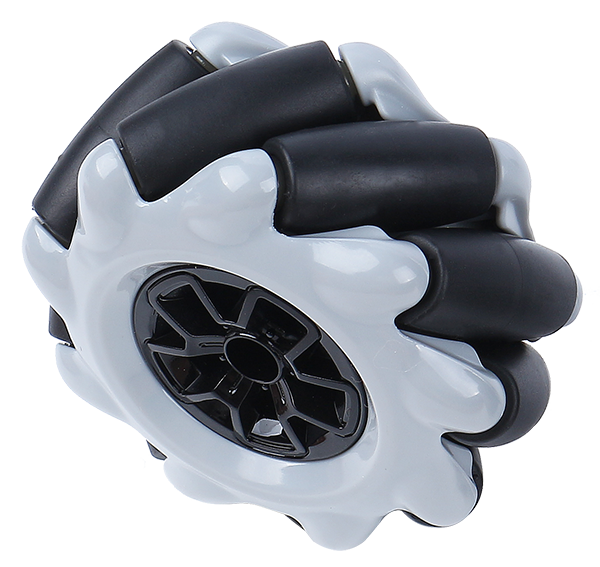
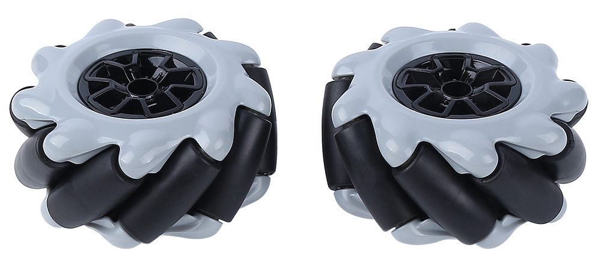
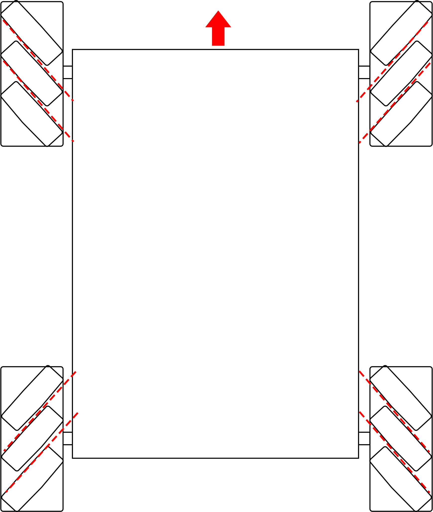

Mecanum-Rad
========================

**Was ist ein Mecanum-Rad?**

Das Mecanum-Rad ist ein omnidirektionales Rad-Design, das es einem landgestützten Fahrzeug ermöglicht, sich in jede Richtung zu bewegen. Es wird manchmal auch als schwedisches Rad oder Ilon-Rad nach seinem Erfinder bezeichnet.

Das Mecanum-Rad ist eine Art von radlosen Rädern, mit einer Reihe von gummierten externen Rollen, die schräg an den gesamten Umfang des Rades angebracht sind. Diese Rollen haben typischerweise eine Rotationsachse im 45°-Winkel zur Radfläche und im 45°-Winkel zur Achslinie.

Jedes Mecanum-Rad ist ein unabhängiges, nicht lenkendes Antriebsrad mit eigenem Antriebsstrang. Beim Drehen erzeugt es eine Vortriebskraft senkrecht zur Rollenachse, die in eine längs- und eine quer gerichtete Komponente im Bezug zum Fahrzeug umgewandelt werden kann.

Das Mecanum-Rad kann je nach 45°-Winkel in linke und rechte Räder unterteilt werden, die Spiegelbilder voneinander sind.

Mecanum-Räder werden normalerweise in Gruppen von vier verwendet, wie in der untenstehenden Abbildung gezeigt.

**Merkmale**

* Durchmesser: 60mm
* Dicke: 30,62mm
* Rollen: 9 Stück
* Winkel: 45°
* Farbe: Schwarz
* Material: Kunststoff + Gummi 
