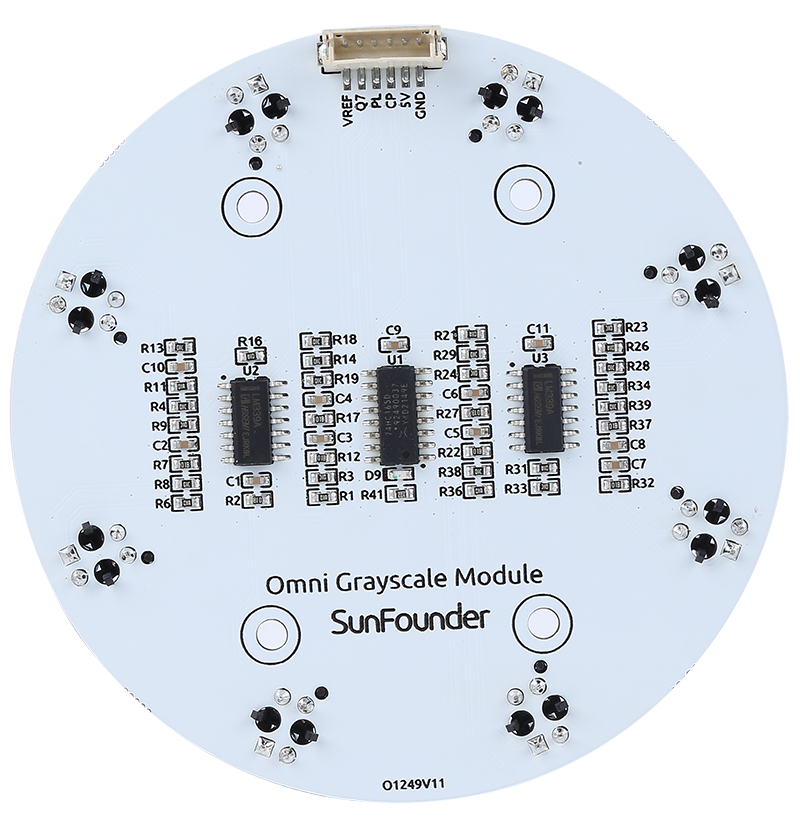
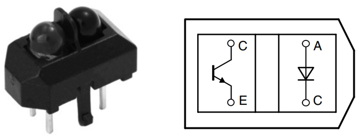
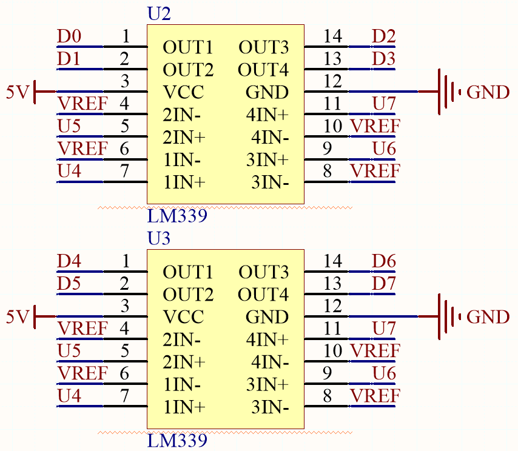
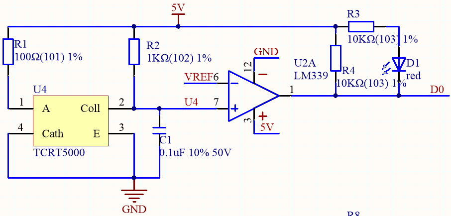
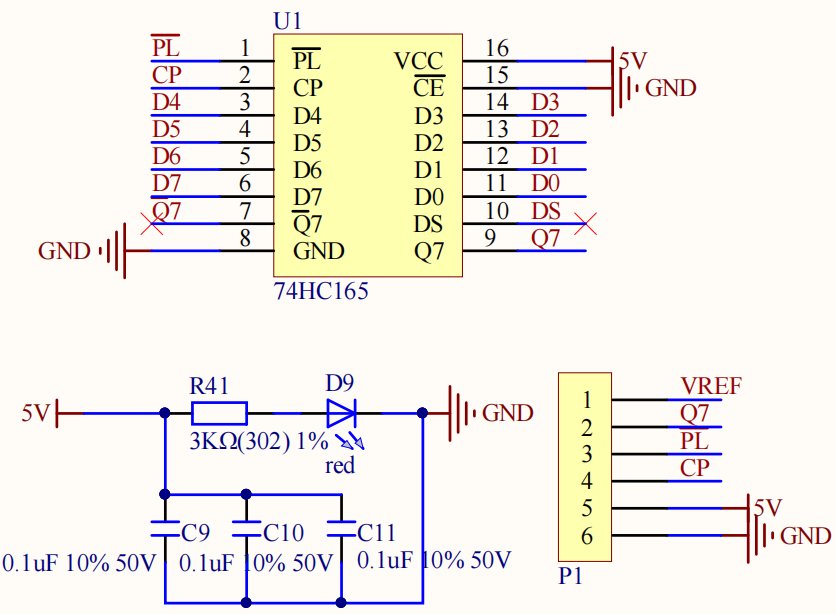

.. note:: 

    Bonjour et bienvenue dans la communauté SunFounder Raspberry Pi & Arduino & ESP32 sur Facebook ! Rejoignez des passionnés pour approfondir vos connaissances sur Raspberry Pi, Arduino et ESP32.

    **Pourquoi nous rejoindre ?**

    - **Support d’experts** : Obtenez de l’aide pour résoudre les problèmes après-vente et relever les défis techniques grâce à notre communauté et notre équipe.
    - **Apprenez & Partagez** : Échangez des astuces et tutoriels pour perfectionner vos compétences.
    - **Aperçus exclusifs** : Accédez en avant-première aux annonces de nouveaux produits et aux coulisses du développement.
    - **Remises spéciales** : Bénéficiez d’offres exclusives sur nos derniers produits.
    - **Promotions festives et cadeaux** : Participez à des concours et offres spéciales à l’occasion des fêtes.

    👉 Prêt à explorer et à créer avec nous ? Cliquez sur [|link_sf_facebook|] et rejoignez-nous dès aujourd’hui !

Module Omni Grayscale
============================

.. image:: img/omni_grayscale_back.png
    :width: 300

* **VREF** : Broche d’entrée de tension de référence. La valeur de chaque capteur est comparée à cette tension de référence pour déterminer si la sortie est haute ou basse.
* **Q7** : Sortie série du dernier étage
* **PL** : Entrée de chargement parallèle asynchrone (active en niveau bas)
* **CP** : Entrée d’horloge (déclenchement sur front montant)
* **5V** : Alimentation en courant continu de 3.3V à 5V
* **GND** : Entrée de masse

Ce module Omni Grayscale est conçu pour le suivi de ligne et la détection des bords. « Omni » signifie omnidirectionnel, ce qui indique que le module est équipé de 8 capteurs TCRT5000 répartis en cercle pour détecter les lignes noires dans toutes les directions.

Cela permet à une voiture robotisée, telle que la Zeus Car équipée de roues Mecanum, de suivre une ligne à différents angles sans que l'avant du véhicule soit nécessairement orienté vers l’avant.

La sensibilité du module peut être ajustée en modifiant la valeur de VREF. Sur le Zeus Car Shield, un potentiomètre bleu permet d’ajuster cette valeur.

**Principe de fonctionnement**

* |link_tcrt5000_datasheet|

Le module intègre huit capteurs TCRT5000, qui fonctionnent sur le principe de la réflexion optique infrarouge. Chaque capteur comprend une diode infrarouge émettrice et un phototransistor protégé par un matériau opaque bloquant la lumière visible.

Lors de son fonctionnement, la diode infrarouge du TCRT5000 émet une lumière infrarouge invisible de longueur d’onde 950 nm. Si la lumière infrarouge n’est pas réfléchie par un obstacle ou si l’intensité de la réflexion est insuffisante, le phototransistor ne fonctionne pas. En revanche, si la lumière est réfléchie avec une intensité suffisante et captée par le phototransistor, ce dernier s’active et fournit une sortie.

* |link_lm339_datasheet|

Le module est équipé de 2 puces LM339, chacune contenant 4 comparateurs différentiels, soit un total de 8 comparateurs. Ceux-ci comparent la valeur du capteur avec une valeur de référence afin de déterminer si la sortie doit être haute ou basse, permettant ainsi de détecter une ligne noire.

Le schéma ci-dessous représente l’un des canaux du module :

* Une tension de référence est définie sur la broche VREF (réglable via un potentiomètre sur le Zeus Car Shield) et appliquée à l’entrée inverseuse (-) du comparateur.
* Le collecteur du phototransistor du capteur TCRT5000 est connecté à l’entrée non-inverseuse (+) du comparateur.
* Lorsque la lumière infrarouge émise par le capteur n’est pas réfléchie ou si l’intensité est insuffisante, le phototransistor ne conduit pas. Son collecteur est alors relié à la résistance de tirage vers 5V, ce qui signifie que l’entrée non-inverseuse (+) du comparateur est supérieure à l’entrée inverseuse (-).
* La sortie du comparateur est donc haute et l’indicateur ne s’allume pas. Inversement, lorsque la lumière est réfléchie, la sortie du comparateur passe à un niveau bas et l’indicateur s’allume.
* Une surface noire absorbe plus de lumière et réfléchit donc moins d’infrarouges, ce qui entraîne une sortie haute du comparateur et l’extinction de l’indicateur.
* Une surface blanche réfléchit davantage d’infrarouges, activant ainsi le phototransistor. La tension en entrée non-inverseuse devient alors plus faible que celle en entrée inverseuse, ce qui entraîne une sortie basse du comparateur et l’allumage de l’indicateur.

Les données des 8 capteurs sont transférées vers la carte Arduino via un registre à décalage 74HC165 (registre à décalage entrée parallèle/sortie série de 8 bits).

* |link_74hc165_datasheet|

Le 74HC165 est un registre à décalage avec entrée parallèle 8 bits et sortie série, capable de fournir des sorties série mutuellement exclusives (Q0 et Q7) en phase finale. Lorsque l'entrée de lecture parallèle (**PL**) est à l’état bas, les données des entrées parallèles D0 à D7 sont chargées de manière asynchrone dans le registre. Lorsque PL est à l’état haut, les données entrent dans le registre en série via l’entrée DS, se décalant d’un bit vers la droite à chaque front montant de l’horloge (Q0 → Q1 → Q2, etc.). Cette caractéristique permet d’effectuer une conversion parallèle-série en connectant simplement la sortie Q7 à l’entrée DS du niveau suivant.

L’entrée d’horloge du 74HC165 adopte une structure "gated OR", qui permet à l’une des entrées d’être utilisée comme une entrée d’activation d’horloge (CE) active en niveau bas. Les assignations des broches **CP** et **CE** sont indépendantes et peuvent être interchangées pour faciliter le câblage si nécessaire. La broche CE ne peut passer de l’état bas à l’état haut que lorsque CP est à l’état haut. Afin d’éviter tout déplacement involontaire des données en mode actif de PL, CP ou CE doivent être réglés à un état haut avant le front montant de PL.

**Caractéristiques**

* Tension de fonctionnement : 3.3 ~ 5V
* Sortie : numérique (on/off)
* Chargement parallèle asynchrone 8 bits
* Entrée série synchrone
* Seuil de détection : réglable via la broche VREF
* Type de capteur : TCRT5000
* Modèle de connecteur : ZH1.5-6P
* Température de fonctionnement : -10 °C à +50 °C
* Dimensions : 80 mm x 80 mm

**Calibration du module**

Comme chaque sol peut avoir des valeurs de gris différentes, le seuil de détection défini en usine peut ne pas être adapté à l’environnement actuel. Il est donc nécessaire de calibrer le module avant utilisation. Il est recommandé d’effectuer une calibration dès que la couleur du sol change de manière significative.

* Placez la Zeus Car sur une surface blanche et tournez le potentiomètre jusqu'à ce que le voyant du capteur de gris s’allume juste.

    .. image:: img/zeus_line_calibration.jpg

* Placez ensuite les deux capteurs de gris latéraux juste entre la ligne noire et la surface blanche, puis tournez lentement le potentiomètre jusqu'à ce que le voyant du signal s’éteigne.

    .. image:: img/zeus_line_calibration1.jpg

* Déplacez la voiture à plusieurs reprises entre la ligne noire et la surface blanche pour vérifier que les capteurs de gris sont bien calibrés : les indicateurs doivent s’éteindre lorsqu’ils sont entre les deux surfaces et s’allumer lorsqu’ils détectent la surface blanche.
