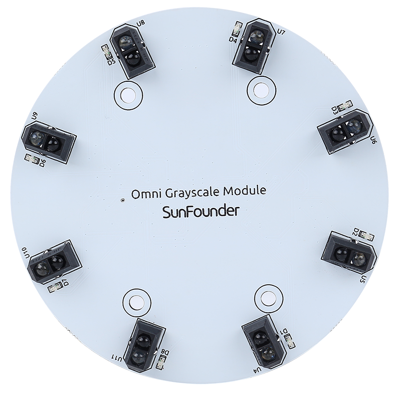

Omni Grayscale Module
============================

.. image:: img/omni_grayscale_front.png
    :width: 300

* **VREF**: Reference voltage input pin. The value of each sensor is compared to this reference voltage to determine whether to output high or low.
* **Q7**: Serial output from the last stage
* **PL**: Asynchronous parallel load input (active LOW)
* **CP**: Clock input (LOW-to-HIGH edge-triggered)
* **5V**: 3.3 to 5V DC Supply Input
* **GND**: Ground Input

This is an Omni Grayscale module for line following and edge detection. Omni means omnidirectional, which means that the module has 8 TCRT5000 transmitting sensors distributed in a circle to detect black lines in any direction.

This allows a robot car like the Zeus Car with Mecanum wheels to follow the line at various angles without having the head of the car facing forward.

The sensitivity of the module in the current environment can be adjusted by modifying the VREF value. In the Zeus Car Shiled, the blue potentiometer is used to adjust the value of the VREF pin.

**Working Principle**

* |link_tcrt5000_datasheet|

In the module, eight TCRT5000 transmitter sensors are integrated, which are based on infrared optical reflection and contain an infrared light-emitting diode and a phototransistor covered with a lead material to block visible light.

.. image:: img/tcrt5000_pin.jpg
    :width: 400
    :align: center

When working, the infrared light-emitting diode of TCRT5000 continuously emits infrared light (invisible light) with a wavelength of 950nm. When the emitted infrared light is not reflected back by the obstacle or the reflection intensity is insufficient, the phototransistor does not work. When the infrared light is reflected with sufficient intensity and received by the phototransistor at the same time, the phototransistor is in working condition and provides output.

* |link_lm339_datasheet|

There are 2 LM339 chips on this Omni Grayscale Module, containing a total of 8 differential comparators. These differential comparators are used to compare the current sensor value with a reference value to determine whether to output a high or low level. This way you know if a black line is detected.

.. image:: img/lm339_chip.png

Below is a schematic of one of the channels.

.. image:: img/tcrt_lm339.png

* Set a reference voltage at the VREF pin (this reference voltage is set via a potentiometer on the Zeus Car Shield) and add this reference voltage to the inverting input (-) of the comparator.
* Add the collector of the TCRT5000 sensor's phototransistor to the in-phase input (+) of the comparator.
* When the infrared ray emitted by the TCRT5000 sensor is not reflected back or the reflection intensity is insufficient, the photosensitive transistor does not work and the collector is connected to the pull-up resistor to 5V at this time, so the in-phase input (+) of the comparator is greater than the inverting input (-).
* The comparator output is high and the indicator does not light up. And vice versa.
* Since the black surface absorbs light, it reflects less infrared light, so on the black surface, the comparator outputs high and the indicator does not light up.
* The white surface reflects more infrared rays, and the photosensitive transistor conducts, so the value of the in-phase input is smaller than the inverted input, and the comparator outputs low, and the indicator lights up.

These 8 sensor data are transferred to the Arduino board via 74HC165 (8-bit parallel input serial output shift register).

* |link_74hc165_datasheet|

The 74HC165 is an 8-bit parallel input serial output shift register, which can get mutually exclusive serial outputs (Q0 and Q7) at the final stage. When the parallel read (PL) input is low, the parallel data input from D0 to D7 port will be read into the register asynchronously. And when PL is high, the data will enter the register serially from the DS input, moving one bit to the right on the rising edge of each clock pulse (Q0 → Q1 → Q2, etc.). Using this feature, the parallel-to-serial expansion can be achieved by simply binding the Q7 output to the next level of DS input.

The clock input of the 74HC165 is a "gated or" structure that allows one of the inputs to be used as a low active clock enable (CE) input. The CP and CE pin assignments are independent and can be interchanged for wiring convenience if necessary. CE is allowed to rise from low to high only when CP is high. CP or CE should be set high before the PL rising edge to prevent data displacement in the active state of PL.

.. image:: img/74hc165_con.png

**Features**

* Operating Voltage: 3.3 ~ 5V
* Output: digital (on/off)
* Asynchronous 8-bit parallel load
* Synchronous serial input
* Detection Threshold: adjustable by VREF pin
* Sensor Type：TCRT5000
* Connector Model：ZH1.5-6P
* Operating Temperature: -10 °C to +50 °C
* Dimensions: 80mm x 80mm

**Calibrate the Module**

    Since each subfloor has different grayscale values, the factory-set grayscale threshold may not be appropriate for your current environment, so you will need to calibrate this module before use. It is recommended that you need to calibrate it whenever the floor color changes a lot.

    * Place the Zeus Car on white surface and turn the potentiometer until the gray sensor light is just illuminated.

        .. image:: img/zeus_line_calibration.jpg

    * Now let the two greyscale sensors on the side be located just between the black line and white surface, and slowly turn the potentiometer until the signal indicator just goes off.

        .. image:: img/zeus_line_calibration1.jpg

    * You can move repeatedly over the the black line and white surface to make sure that the lights of the greyscale sensor are off when they are between the the black line and white surface and on when they are on the white surface, indicating that the module is successfully calibrated.

