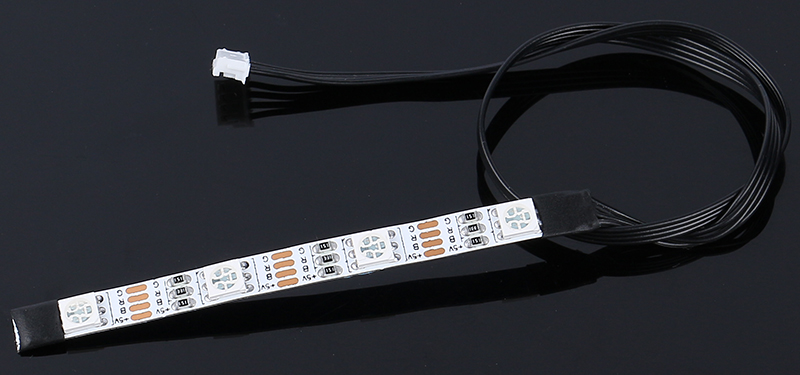

.. note:: 

    Ciao, benvenuto nella Community di Appassionati di Raspberry Pi, Arduino e ESP32 di SunFounder su Facebook! Esplora più a fondo il mondo di Raspberry Pi, Arduino ed ESP32 insieme ad altri entusiasti.

    **Perché unirsi?**

    - **Supporto esperto**: Risolvi problemi post-vendita e sfide tecniche con l'aiuto della nostra community e del nostro team.
    - **Impara e condividi**: Scambia consigli e tutorial per migliorare le tue competenze.
    - **Anteprime esclusive**: Ottieni accesso anticipato agli annunci di nuovi prodotti e alle anteprime esclusive.
    - **Sconti speciali**: Approfitta di sconti esclusivi sui nostri ultimi prodotti.
    - **Promozioni festive e giveaway**: Partecipa a giveaway e offerte speciali durante le festività.

    👉 Pronto a esplorare e creare con noi? Clicca su [|link_sf_facebook|] e unisciti subito!

4 RGB LEDs Strip
====================

* **+5V**: Anodo comune dei tre LED, deve essere collegato a DC 5V
* **B**: Catodo del LED blu
* **R**: Catodo del LED rosso
* **G**: Catodo del LED verde

La striscia RGB è composta da 4 LED RGB ed è in grado di generare qualsiasi sfumatura di colore grazie alla combinazione dei tre colori primari: rosso, blu e verde.

I LED RGB utilizzati sono di tipo 5050, collegati in configurazione a anodo comune. Ogni LED è un circuito indipendente e può essere tagliato lungo i segni di separazione senza danneggiare le altre parti. Realizzata su una scheda FPC e dotata di adesivo biadesivo sul retro, la striscia può essere piegata e fissata facilmente a piacimento.

**Caratteristiche**

* Tensione di funzionamento: DC 5V
* Colore: RGB a colori completi
* Temperatura di esercizio: -15°C ~ 50°C
* Tipo RGB: 5050RGB
* Corrente: 150mA (per singolo circuito)
* Potenza: 1.5W
* Spessore della striscia: 2mm
* Larghezza della striscia: 5.5mm
* Cavo: ZH1.5-4P, 25cm, 28AWG, nero
