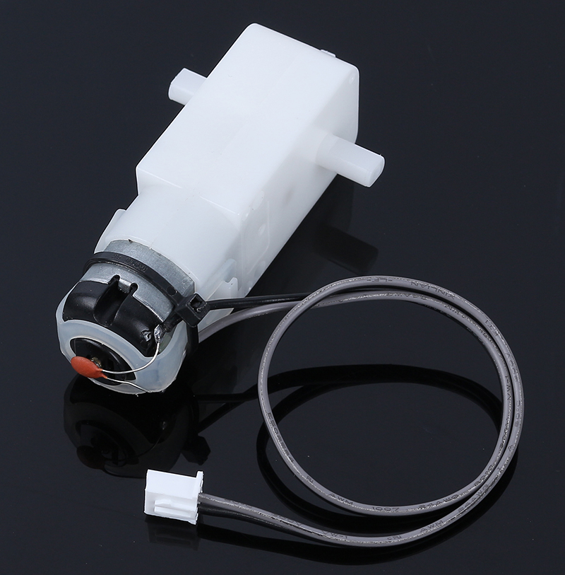

.. note::

    こんにちは、SunFounderのRaspberry Pi & Arduino & ESP32愛好家コミュニティへようこそ！Facebook上でRaspberry Pi、Arduino、ESP32についてもっと深く掘り下げ、他の愛好家と交流しましょう。

    **参加する理由は？**

    - **エキスパートサポート**：コミュニティやチームの助けを借りて、販売後の問題や技術的な課題を解決します。
    - **学び＆共有**：ヒントやチュートリアルを交換してスキルを向上させましょう。
    - **独占的なプレビュー**：新製品の発表や先行プレビューに早期アクセスしましょう。
    - **特別割引**：最新製品の独占割引をお楽しみください。
    - **祭りのプロモーションとギフト**：ギフトや祝日のプロモーションに参加しましょう。

    👉 私たちと一緒に探索し、創造する準備はできていますか？[|link_sf_facebook|]をクリックして今すぐ参加しましょう！

.. _cpn_tt_motor:

TTモーター
==============

こちらはギア比1:48のTT DCモーターで、XH2.54-2Pコネクター付きの2 x 250mmのワイヤーが付属しています。

これらのモーターは3〜6VDCで動作させることができますが、高電圧で少し速く動作します。

これらはエンコーダ、速度制御、位置フィードバックが組み込まれていない非常に基本的なモーターです。電圧を入力として、回転が出力として得られます。モーターごとに多少のばらつきがあるため、正確な動作が必要な場合は、別のフィードバックシステムが必要です。

**特長**

* 定格電圧: 3~6V
* 無負荷電流: 150mA +/- 10%
* 最低動作速度 (3V): 90+/- 10% RPM
* 最低動作速度 (6V): 200+/- 10% RPM
* ストールトルク (3V): 0.4kg.cm
* ストールトルク (6V): 0.8kg.cm
* ギア比: 1:48
* 本体寸法: 70 x 22.3 x 36.9mm
* ワイヤー: グレーとブラック, 24AWG, 250mm
* コネクタ: XH2.54-2P
* 重量: 30.6g

**寸法図**

単位: mm

.. image:: img/motor_size.jpg
