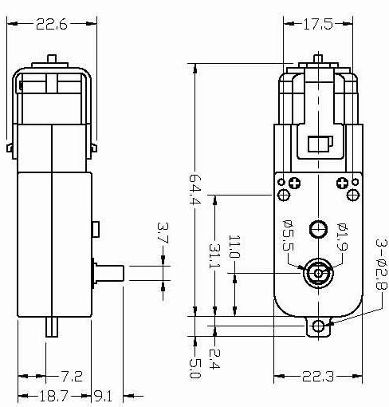

.. _cpn_tt_motor:

TT Motor
==============

.. image:: img/tt_motor_xh.jpg
    :width: 400
    :align: center

Hier handelt es sich um einen TT Gleichstrommotor mit einem Übersetzungsverhältnis von 1:48. Er ist mit 2 x 250mm Kabeln mit XH2.54-2P Steckverbinder ausgestattet.

Sie können diese Motoren mit 3 ~ 6VDC betreiben. Selbstverständlich laufen sie bei höheren Spannungen etwas schneller.

Beachten Sie, dass dies sehr einfache Motoren ohne integrierten Encoder, Geschwindigkeitsregelung oder Positionsfeedback sind. Spannung geht rein, Drehung kommt raus. Es wird Unterschiede von Motor zu Motor geben, daher benötigen Sie für präzise Bewegungen ein separates Feedback-System.

**Eigenschaften**

* Nennspannung: 3~6V
* Kontinuierlicher Leerlaufstrom: 150mA +/- 10%
* Min. Betriebsgeschwindigkeit (3V): 90+/- 10% RPM
* Min. Betriebsgeschwindigkeit (6V): 200+/- 10% RPM
* Haltemoment (3V): 0,4kg.cm
* Haltemoment (6V): 0,8kg.cm
* Übersetzungsverhältnis: 1:48
* Körperabmessungen: 70 x 22,3 x 36,9mm
* Kabel: Grau und Schwarz, 24AWG, 250mm
* Steckverbinder: XH2.54-2P
* Gewicht: 30,6g

**Abmessungszeichnung**

Einheit: mm

