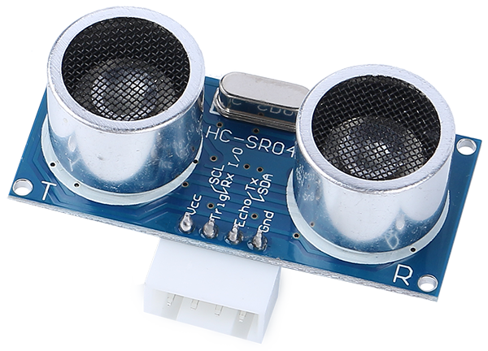

.. note::

    こんにちは、SunFounderのRaspberry Pi & Arduino & ESP32愛好家コミュニティへようこそ！Facebook上でRaspberry Pi、Arduino、ESP32についてもっと深く掘り下げ、他の愛好家と交流しましょう。

    **参加する理由は？**

    - **エキスパートサポート**：コミュニティやチームの助けを借りて、販売後の問題や技術的な課題を解決します。
    - **学び＆共有**：ヒントやチュートリアルを交換してスキルを向上させましょう。
    - **独占的なプレビュー**：新製品の発表や先行プレビューに早期アクセスしましょう。
    - **特別割引**：最新製品の独占割引をお楽しみください。
    - **祭りのプロモーションとギフト**：ギフトや祝日のプロモーションに参加しましょう。

    👉 私たちと一緒に探索し、創造する準備はできていますか？[|link_sf_facebook|]をクリックして今すぐ参加しましょう！

超音波モジュール
================================

* **TRIG**: トリガーパルス入力
* **ECHO**: エコーパルス出力
* **GND**: グラウンド
* **VCC**: 5V 電源

こちらはHC-SR04超音波距離センサで、非接触測定を2 cmから400 cmまでの範囲で、最大3 mmの精度で提供します。モジュールには超音波送信機、受信機、および制御回路が含まれています。

4つのピンだけを接続する必要があります：VCC（電源）、Trig（トリガー）、Echo（受信）およびGND（グラウンド）を接続するだけで、計測プロジェクトに簡単に使用できます。

**特長**

* 動作電圧: DC5V
* 動作電流: 16mA
* 動作周波数: 40Hz
* 最大測定範囲: 500cm
* 最小測定範囲: 2cm
* トリガー入力信号: 10uS TTLパルス
* エコー出力信号: 入力TTLレベル信号および測定範囲に比例
* コネクタ: XH2.54-4P
* 外寸: 46x20.5x15 mm

**原理**

以下の基本原則に従います：

* IOトリガーを少なくとも10usの高レベル信号で使用します。
* モジュールは40 kHzで超音波の8サイクルバーストを送信し、パルス信号が受信されたかどうかを検出します。
* 信号が返されると、Echoは高レベルを出力します。高レベルの持続時間は、放射から返還までの時間です。
* 距離 = (高レベル時間 x 音の速度(340M/S)) / 2

    .. image:: img/ultrasonic_prin.jpg
        :width: 800

計算式: 

* us / 58 = センチメートル距離
* us / 148 = インチ距離
* distance = 高レベル時間 x 速度(340M/S) / 2

**使用上の注意**

* このモジュールは電源投入時に接続しないでください。必要な場合、モジュールのGNDを先に接続してください。そうしないと、モジュールの動作に影響が出る可能性があります。
* 測定する対象の面積は最低でも0.5平方メートルで、できるだけ平坦である必要があります。そうでないと、結果に影響が出る可能性があります。
