Zeus Car Shield
=========================

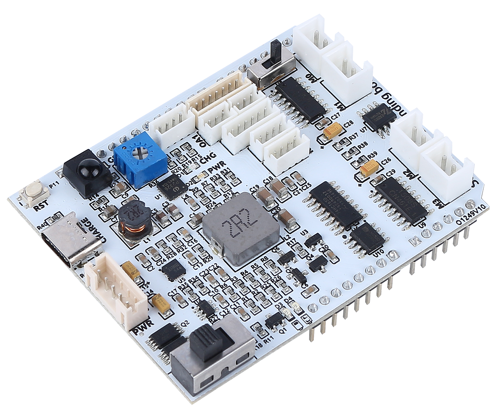

This is an all-in-one expansion board designed for Arduino by SunFounder, which contains various module ports such as motor, light bar, obstacle avoidance, grayscale, ESP32 CAM and ultrasonic module. There is also a built-in HS0038B IR receiver for remote control.

This expansion board also has a built-in charging circuit, which can charge the battery with PH2.0-5P interface, and the estimated charging time is 130 minutes.

**Zeus Car Shield Pinout**

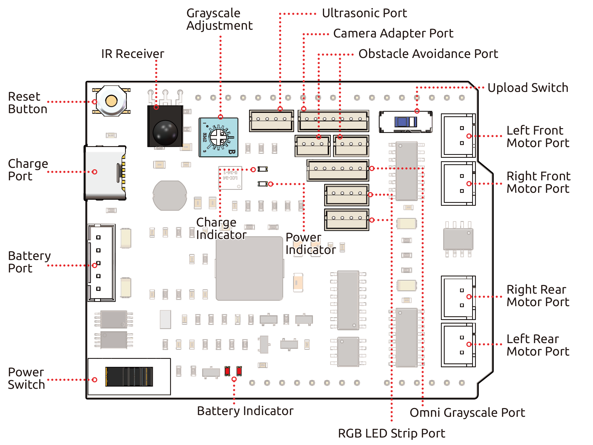

* Reset Button
    * Press this button to reset the program on the Arduino board.

* Charge Port
    * After plugging into the 5V/2A USB-C port, it can be used to charge the battery for 130min.

* :ref:`shield_battry_pin`: 
    * 6.6V~8.4V PH2.0-5P power input.
    * Powering the Zeus Car Shield and Arduino board at the same time.

* Power Switch
    * Slide to ON to power on the Zeus Car Shield.

* IR Receiver
    * This is an HS0038B IR receiver with the signal pin connected to pin 2 of the Arduino board.

* :ref:`shield_grayscale_pin`
    * Grayscale adjustment potentiometer: used to set the reference voltage for Omni grayscale module
    * Grayscale Port: Used to connect Omni Grayscale module.

* Indicators
    * **Charge Indicator**: Glows red when the shield is charging through the USB-C port.
    * **Power Indicator**: Glows green when the power switch is in the "ON" position.
    * **Battery Indicator**: Two orange indicators represent different battery levels. They flash during charging and turn off when the battery needs charging.

* :ref:`shield_ultrasonic_pin`
    * To connect the ultrasonic module, both Trig & Echo pins are connected on pin 10 of the Arduino board.

* :ref:`shield_camera_pin`
    * The Camera Adapter Board port.

* :ref:`shield_avoid_pin`
    * Used for connecting two IR obstacle avoidance modules, the signal pins of the two ports are connected to Q0 and Q1 of 74HC165.

* :ref:`shield_strip_pin`
    * For connecting 2 RGB LED Strips, the three pins of the strip are connected to 12, 13 and 11 respectively.

* Run Switch
   * When you need to use the camera, you need to toggle this switch to the other side so that the ESP32-CAM can communicate with the Arduino board.

* :ref:`shield_motor_pin`
    * 4 groups of motor ports.

.. _shield_battry_pin:

Battery Port
----------------

Here is the pinout diagram for the battery interface. The type is PH2.0-5P, and the power input range is 6.6V~8.4V.

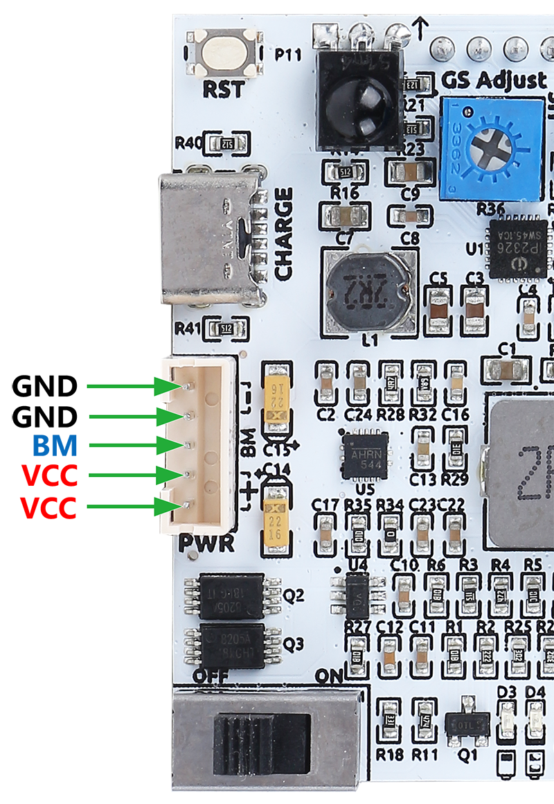

.. _shield_grayscale_pin:

Grayscale Module Related
-----------------------------

A blue potentiometer on the Zeus Car Shield is used to adjust the grayscale module's sensitivity to different environments by setting the reference voltage for the grayscale module. Through the VREF pin, the grayscale module receives the set reference voltage.

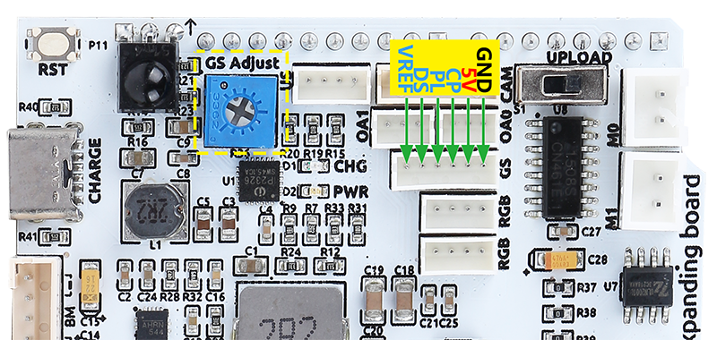

Here is the schematic diagram. The values of the grayscale module are transferred from the 74HC165 chip to the Arduino board. Since the grayscale module itself comes with a 74HC165 chip, the cascade of these two chips will transfer 16 bits of data to the Arduino board - the first 8 bits are grayscale sensor data, and the last two are IR obstacle avoidance data.

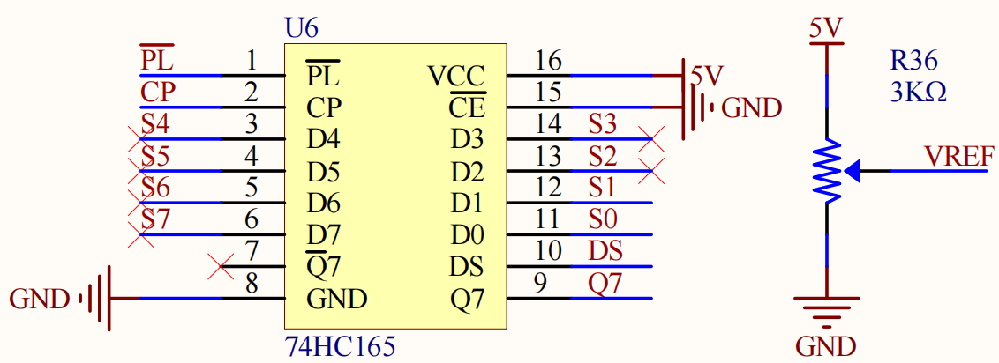

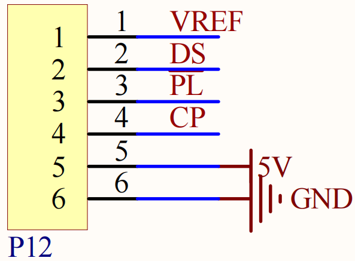

The pin mapping of this port on the Arduino board is shown below.

.. list-table::
    :widths: 25 50

    * - Arduino Board
      - Zeus Car Shield
    * - 7
      - 74HC165 Q7
    * - 8
      - 74HC165 CP
    * - ~9
      - 74HC165 PL

.. _shield_ultrasonic_pin:

Ultrasonic Port
--------------------

This is the pinout for the ZH1.5-4P ultrasonic port, with the Trig & Echo pins connected to pin 10 of the Arduino board.

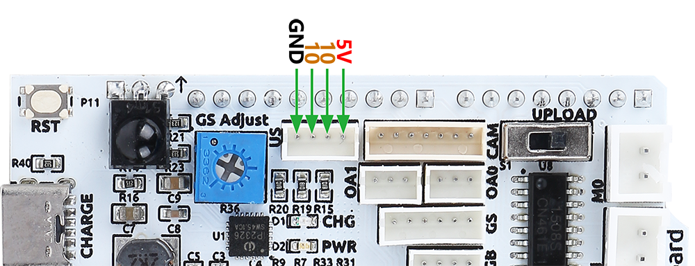

.. _shield_camera_pin:

Camera Adapter Port
----------------------

The camera adapter interface pin diagram is shown here, the type is ZH1.5-7P.

* TX and RX are used for ESP32 CAM.
* SDA and SCL are for QMC6310.

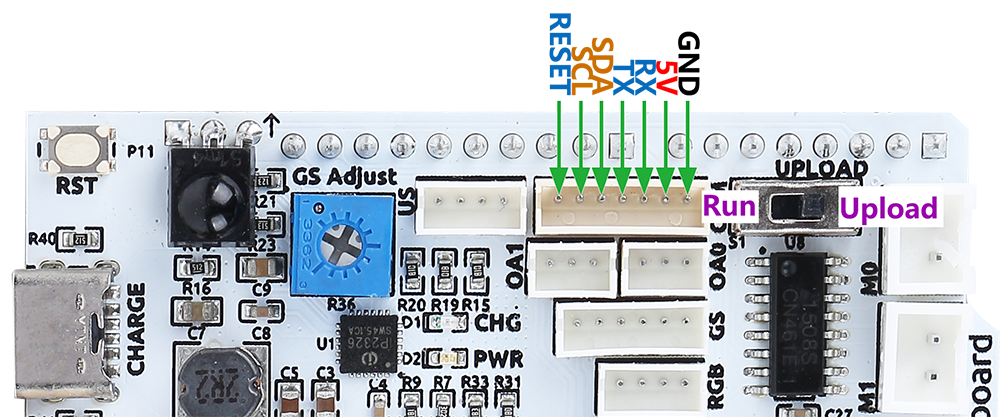

.. _shield_avoid_pin:

Obstacle Avoidance Port
----------------------------

Below is the pinout diagram of the two ZH1.5-3P obstacle avoidance ports.

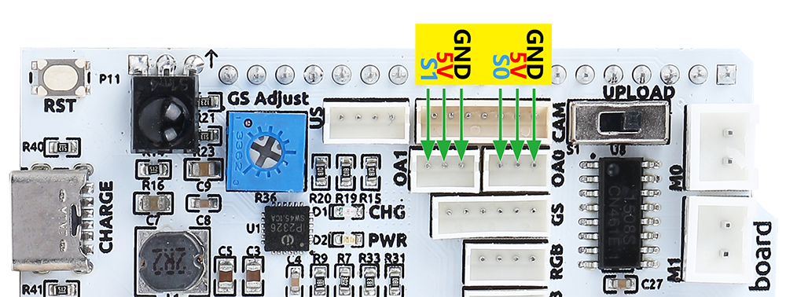

As shown in the circuit diagram, S1 and S0 refer to Q0 and Q1 on the 74HC165 chip. Two 74HC165 cascades transfer the data of the two IR obstacle avoidance modules and the grayscale sensor to the Arduino board. The first eight bits are grayscale sensor data, and the last two bits represent IR obstacle avoidance data.

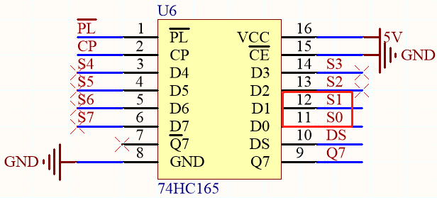

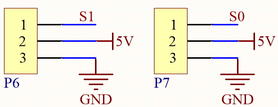

.. _shield_strip_pin:

RGB LED Strip Port
-------------------------

Below is the pinout diagram of the two RGB LED Strip, they are connected in parallel and the pinouts are the same.

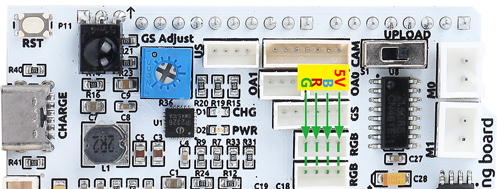

Here is the schematic.

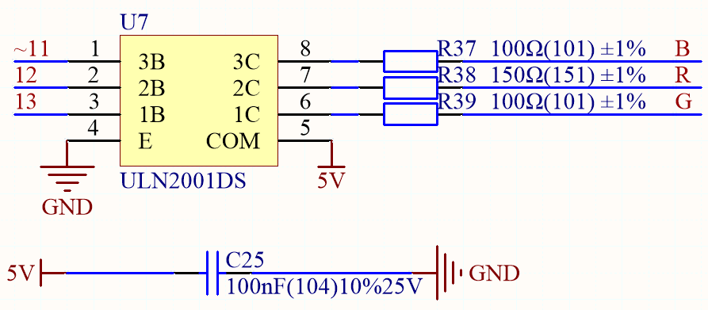
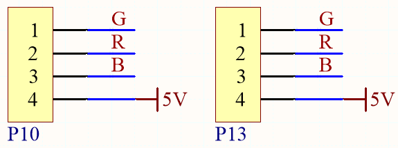

.. _shield_motor_pin:

Motor Port
---------------

Here is the pinout of the 4 sets of motor ports.

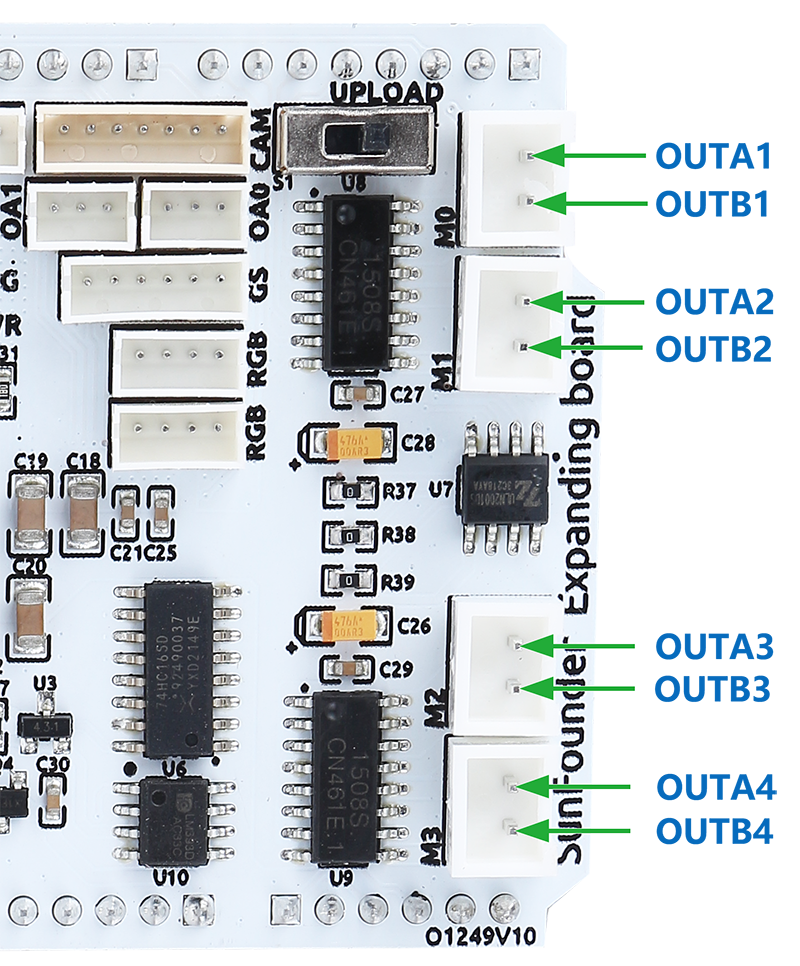

These 4 sets of motors are driven by 2 TC1508S chips, which is a dual-channel motor driver chip with a maximum continuous output current of up to 1.8A/per channel.

Here is the schematic.

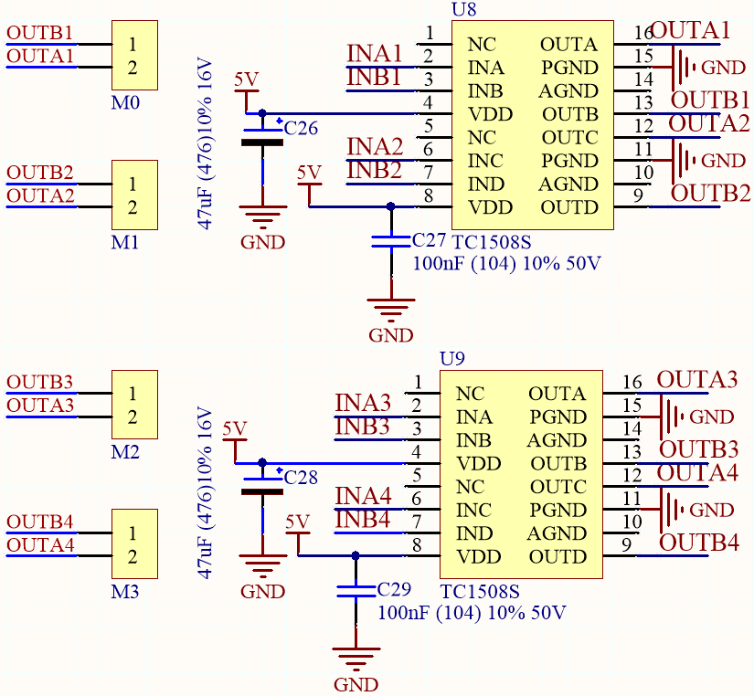

So the corresponding control pins of the 4 motor ports are shown below.

.. list-table::
    :widths: 25 50

    * - Arduino Board
      - Zeus Car Shield
    * - ~3
      - OUTA1
    * - 4
      - OUTB1
    * - ~5
      - OUTA2
    * - ~6
      - OUTB2
    * - A0
      - OUTB4
    * - A1
      - OUTA4
    * - A2
      - OUTB3
    * - A3
      - OUTA3

