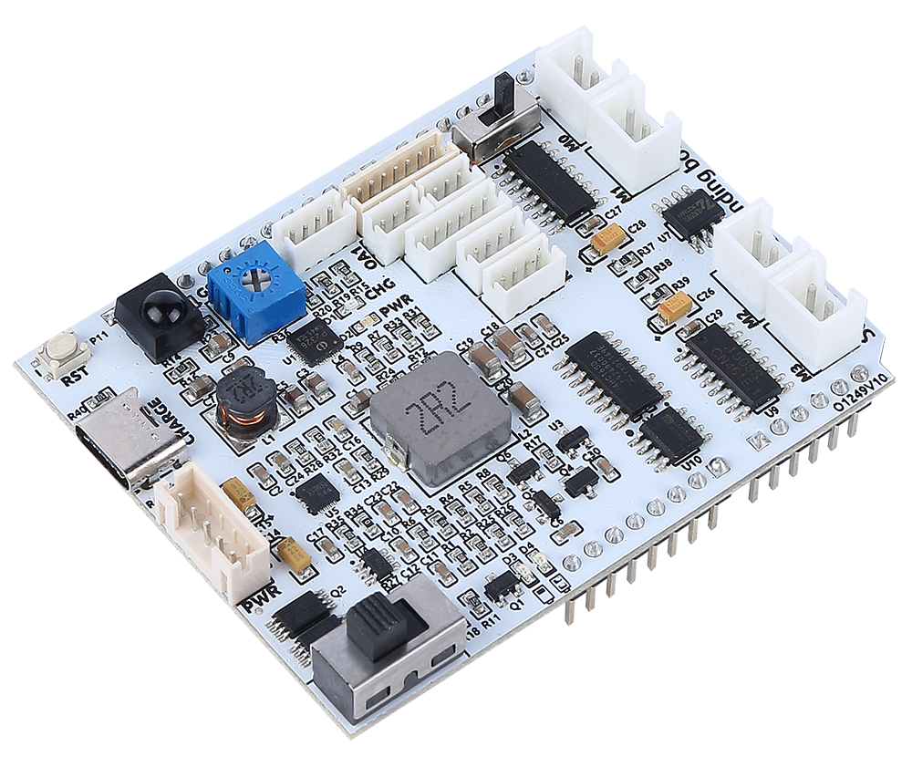

.. note::

    ¡Hola! Bienvenido a la comunidad de entusiastas de SunFounder Raspberry Pi, Arduino y ESP32 en Facebook. Únete a nosotros y sumérgete en el fascinante mundo de Raspberry Pi, Arduino y ESP32 junto con otros apasionados.

    **Why Join?**

    - **Expert Support**: Resuelve problemas postventa y supera desafíos técnicos con la ayuda de nuestra comunidad y equipo.
    - **Learn & Share**: Intercambia consejos y tutoriales para mejorar tus habilidades.
    - **Exclusive Previews**: Sé el primero en conocer los anuncios de nuevos productos y obtener adelantos exclusivos.
    - **Special Discounts**: Disfruta de descuentos exclusivos en nuestros productos más recientes.
    - **Festive Promotions and Giveaways**: Participa en sorteos y promociones especiales durante las festividades.

    游녤 쯃isto para explorar y crear con nosotros? Haz clic en [|link_sf_facebook|] y únete hoy mismo.

Zeus Car Shield
=========================

Esta es una placa de expansión todo en uno diseñada por SunFounder para Arduino, que incluye múltiples puertos para módulos como motores, barra de luces, evitación de obstáculos, sensor de escala de grises, ESP32 CAM y sensor ultrasónico. También cuenta con un receptor IR HS0038B integrado para el control remoto.

Además, la placa de expansión incorpora un circuito de carga, permitiendo cargar la batería a través de una interfaz PH2.0-5P, con un tiempo estimado de carga de 130 minutos.

**Diagrama de pines de Zeus Car Shield**

* Botón de reinicio
    * Presiona este botón para reiniciar el programa en la placa Arduino.

* **Puerto de carga**
    * Conéctalo a un puerto USB-C de 5V/2A para cargar la batería (tiempo estimado: 130 min).

* :ref:`shield_battry_pin`: 
    * Entrada de alimentación 6.6V~8.4V a través de PH2.0-5P.
    * Alimenta tanto la Zeus Car Shield como la placa Arduino simultáneamente.

* Interruptor de encendido
    * Deslízalo a la posición ON para encender la Zeus Car Shield.

* Receptor IR
    * HS0038B, con el pin de señal conectado al pin 2 de la placa Arduino.

* :ref:`shield_grayscale_pin`
    * Potenciómetro de ajuste de escala de grises: Establece el voltaje de referencia para el módulo de escala de grises Omni.
    * Puerto de escala de grises: Conexión para el módulo de escala de grises Omni.

* Indicadores LED
    * **Indicador de carga**: Se ilumina rojo cuando la placa está cargando a través del USB-C.
    * **Indicador de encendido**: Se ilumina verde cuando el interruptor de alimentación está en ON.
    * **Indicador de batería**: Dos LED naranjas indican diferentes niveles de batería. Parpadean durante la carga y se apagan cuando la batería necesita recargarse.

* :ref:`shield_ultrasonic_pin`
    * Para conectar el módulo ultrasónico. Los pines Trig & Echo están conectados al pin 10 de la placa Arduino.

* :ref:`shield_camera_pin`
    * Puerto para la placa adaptadora de cámara.

* :ref:`shield_avoid_pin`
    * Conexión para dos módulos de evitación de obstáculos por IR. Sus pines de señal están conectados a Q0 y Q1 del 74HC165.

* :ref:`shield_strip_pin`
    * Conexión para 2 tiras LED RGB. Sus pines están conectados a 12, 13 y 11 respectivamente.

* **Interruptor de ejecución**
   * Para utilizar la cámara, cambia este interruptor de posición para permitir la comunicación entre la ESP32-CAM y la placa Arduino.

* :ref:`shield_motor_pin`
    * 4 grupos de puertos para motores.

.. _shield_battry_pin:

Puerto de batería
-------------------

Diagrama de pines del puerto de batería, tipo PH2.0-5P, con un rango de entrada de 6.6V~8.4V.

.. image:: img/shield_battery_pin.png
    :width: 400
    :align: center

.. _shield_grayscale_pin:

Módulo de escala de grises
-----------------------------

El potenciómetro azul en la Zeus Car Shield permite ajustar la sensibilidad del módulo de escala de grises al entorno, estableciendo un voltaje de referencia (VREF).

.. image:: img/shield_grayscale_pin.png

Aquí está el esquema del circuito. Los valores del módulo de escala de grises se transfieren desde el chip 74HC165 a la placa Arduino. Como el módulo de escala de grises incluye un 74HC165, la conexión en cascada de estos dos chips transmite 16 bits de datos a la placa Arduino: los primeros 8 bits corresponden a los sensores de escala de grises, y los últimos 2 bits a los datos del sensor de evitación de obstáculos por IR.

.. image:: img/shield_grayscale1.png
.. image:: img/shield_grayscale2.png
    :width: 400

Asignación de pines en la placa Arduino:

.. list-table::
    :widths: 25 50

    * - Arduino Board
      - Zeus Car Shield
    * - 7
      - 74HC165 Q7
    * - 8
      - 74HC165 CP
    * - ~9
      - 74HC165 PL

.. _shield_ultrasonic_pin:

Puerto ultrasónico
--------------------

Diagrama de pines para el puerto ultrasónico ZH1.5-4P, donde los pines Trig & Echo están conectados al pin 10 de la placa Arduino.

.. image:: img/shield_ultrasonic_pin.png

.. _shield_camera_pin:

Puerto para adaptador de cámara
--------------------------------------

Diagrama de pines para la interfaz del adaptador de cámara, tipo ZH1.5-7P.

* TX y RX: Comunicación con la ESP32-CAM.
* SDA y SCL: Conexión para el QMC6310.

.. image:: img/shield_camera_pin.png

.. _shield_avoid_pin:

Puerto de evitación de obstáculos
----------------------------------------

Diagrama de pines para los dos puertos de evitación de obstáculos ZH1.5-3P.

.. image:: img/shield_avoid_pin.png

En el esquema del circuito, S1 y S0 se refieren a Q0 y Q1 en el chip 74HC165. La conexión en cascada de dos 74HC165 transfiere los datos de los dos sensores de evitación de obstáculos por IR y del sensor de escala de grises a la placa Arduino.

.. image:: img/shield_avoid_sche.png

.. _shield_strip_pin:

Puerto para tiras LED RGB
----------------------------

Diagrama de pines para las 2 tiras LED RGB, conectadas en paralelo con la misma asignación de pines.

.. image:: img/shield_strip_pin.png

Esquema del circuito:

.. image:: img/shield_strip_sche1.png

.. _shield_motor_pin:

Puerto de motores
-------------------

Diagrama de pines para los 4 puertos de motores.

.. image:: img/shield_motor_pin.png
    :width: 400
    :align: center

Estos motores son controlados por 2 chips TC1508S, cada uno con dos canales y una corriente de salida máxima de 1.8A por canal.

Esquema del circuito:

.. image:: img/shield_motor_sche.png

Asignación de pines en la placa Arduino:

.. list-table::
    :widths: 25 50

    * - Arduino Board
      - Zeus Car Shield
    * - ~3
      - OUTA1
    * - 4
      - OUTB1
    * - ~5
      - OUTA2
    * - ~6
      - OUTB2
    * - A0
      - OUTB4
    * - A1
      - OUTA4
    * - A2
      - OUTB3
    * - A3
      - OUTA3

