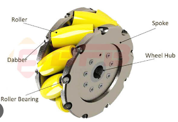
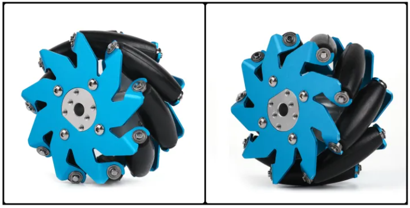

Mecanum Wheel
========================

**什么是麦克纳姆伦？**

The mecanum wheel is an omnidirectional wheel design for a land-based vehicle to move in any direction. It is sometimes called the Swedish wheel or Ilon wheel after its inventor.

The mecanum wheel is a form of tireless wheel, with a series of rubberized external rollers obliquely attached to the whole circumference of its rim. These rollers typically each have an axis of rotation at 45° to the wheel plane and at 45° to the axle line.[3] Each Mecanum wheel is an independent non-steering drive wheel with its own powertrain, and when spinning generates a propelling force perpendicular to the roller axle, which can be vectored into a longitudinal and a transverse component in relation to the vehicle.

麦克纳姆伦根据夹角45°，可以分为互为镜像关系的A轮和B轮。由速度的正向分解，A轮可以分解为轴向向左和向前的力。

B轮方向与A轮成镜像关系。则由上，麦克纳姆伦用于四轮平台移动时的组合分为：AAAA,BBBB, ABAB, 

**麦轮的安装方法**

麦轮一般是四个一组使用，两个左旋轮，两个右旋轮。左旋轮和右旋轮呈手性对称，区别如下图。

安装方式有多种，主要分为：X-正方形（X-square）、X-长方形（X-rectangle）、O-正方形（O-square）、O-长方形（O-rectangle）。其中 X 和 O 表示的是与四个轮子地面接触的辊子所形成的图形；正方形与长方形指的是四个轮子与地面接触点所围成的形状。

* X-正方形：轮子转动产生的力矩会经过同一个点，所以 yaw 轴无法主动旋转，也无法主动保持 yaw 轴的角度。一般几乎不会使用这种安装方式。
* X-长方形：轮子转动可以产生 yaw 轴转动力矩，但转动力矩的力臂一般会比较短。这种安装方式也不多见。
* O-正方形：四个轮子位于正方形的四个顶点，平移和旋转都没有任何问题。受限于机器人底盘的形状、尺寸等因素，这种安装方式虽然理想，但可遇而不可求。
* O-长方形：轮子转动可以产生 yaw 轴转动力矩，而且转动力矩的力臂也比较长。是最常见的安装方式。

Zeus Car使用的是O-长方形的组装方式。

**它是如何移动的？**
