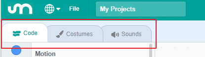
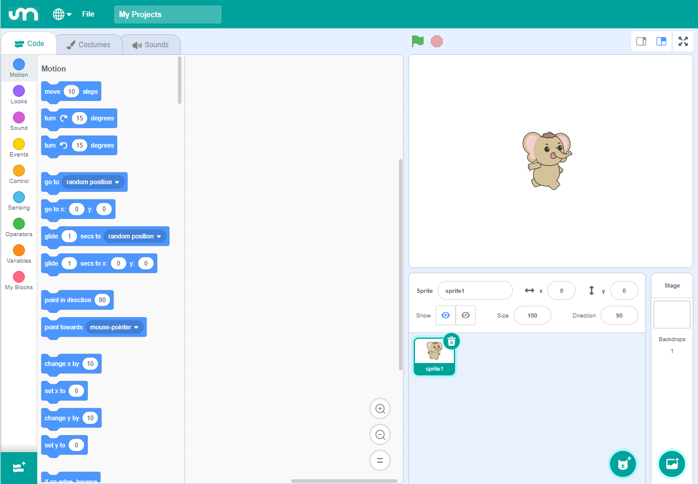
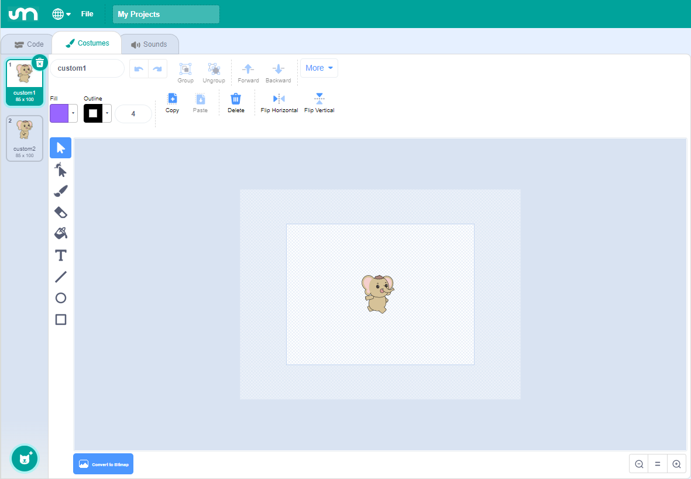
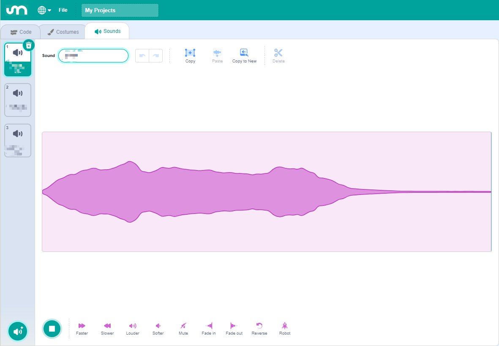

1. Getting Started with the Mammoth Coding App
===========================================================

Let's dive into the world of Mammoth Coding and create your first project! For an optimal experience, it's recommended to use a device with a larger screen.

You Will Learn
----------------------

* Set up the Mammoth Coding programming environment.
* Understand basic programming concepts in Mammoth Coding.
* Write and run your first program.

Installing the APP
----------------------

1. Search for **Mammoth Coding** on Google Play or the Apple App Store and install it.

   .. image:: img/1_app_install.png
      :width: 600
      :align: center

2. After installation, you can open it. Here's what the interface looks like on larger screens:

   .. image:: img/1_app_ui_001.png
      :width: 600
      :align: center

3. For devices with smaller screens, the interface appears as follows:

   .. image:: img/1_app_ui_002.png
      :width: 600
      :align: center

Understanding the APP
-----------------------------------

Mammoth Coding is designed to be fun, educational, and easy to learn. It provides tools for creating interactive stories, games, art, simulations, and more using block-based coding. It also includes built-in drawing and sound editors.

Top Section
^^^^^^^^^^^^^^

The top section of Mammoth Coding includes several essential options.

* **Language Settings**: The first option on the left allows you to choose different languages. Currently, English and Simplified Chinese are available.
* **File Menu**: The second option is the **File** menu, where you can create new projects, open existing ones, and save your current project.
* **Project Name**: The third option allows you to rename your project.

Navigation Bar
^^^^^^^^^^^^^^^^^^^^^

Just below the top section is the navigation bar, which allows you to switch between different editing pages.

On smaller screens:

* The navigation bar appears at the top with options for **Code**, **Costumes**, **Sounds**, and **Stage**.

  .. image:: img/1_app_ui_2.png

* The **Stage** page is actually the right-hand side of the interface on larger screens, separated out on smaller devices to avoid clutter.

  .. image:: img/1_app_ui_4.png
     :width: 600

Code Area
^^^^^^^^^^^^^^

The **Code** page is where most of your programming activities will take place.

Costumes
^^^^^^^^^^^^^^^

The **Costumes** page is used to edit sprites and backdrops, providing visual elements for your programs.

Sounds
^^^^^^^^^^^^^

The **Sounds** page handles audio, providing multimedia elements for your programs.

Creating Your First Program
----------------------------------------

1. Create or Open a Project
^^^^^^^^^^^^^^^^^^^^^^^^^^^^^^^^^^^

* Each time you open the Mammoth Coding App, a new project is automatically created.

  .. image:: img/1_open_new.png
     :width: 600

* Change the default project name "My Project" to something meaningful.

  .. image:: img/1_new_name.png
     :width: 600

* You can also open a project that you've previously saved on your device.

  .. image:: img/1_new_save.png
     :width: 600

2. Choose a Sprite
^^^^^^^^^^^^^^^^^^^^^^^^^

* When you start a new project, a default sprite is provided. You can:

  * Use the default sprite.
  * Choose a new sprite from the library.
  * Draw your own sprite.
  * Upload a sprite from your device.

  .. image:: img/1_choose_sprite.png

* To choose a new sprite: Tap **"Choose a Sprite"** and select **"Zeus Car"**.

  .. image:: img/1_choose_zeus_car.png

3. Write the Program
^^^^^^^^^^^^^^^^^^^^^^^^^^^^

In the left sidebar, you'll find various categorys containing different categories of blocks. You can drag blocks from these categorys into the scripting area to build your program.

For example, to make the **Zeus Car** sprite move forward 10 steps and then switch to the next costume when the green flag is clicked:

1. From the **Events** category, drag out the **"When green flag clicked"** block into the scripting area.

     .. image:: img/1_code_flag.png
        :width: 600

2. From the **Motion** category, drag out the **"Move (10) steps"** block and snap it below the event block.

     .. image:: img/1_code_move10.png
        :width: 600

3. From the **Looks** category, drag out the **"Next costume"** block and attach it below the motion block.

     .. image:: img/1_code_next.png
        :width: 600

4. Run the Program
^^^^^^^^^^^^^^^^^^^^^^^^^^^

There are two ways to run your program:

1. Simply tap on the stack of blocks you've assembled in the scripting area. A yellow highlight will appear, indicating the script is running.

     .. image:: img/1_code_run.png
        :width: 30%

2. If your script starts with the **"When green flag clicked"** block, you can click the green flag at the top left of the **Stage** to run your program. This is recommended for projects with multiple sprites or more complex code.

     .. image:: img/1_code_green_flag.png
        :width: 70%

5. Save Your Project
^^^^^^^^^^^^^^^^^^^^^^^^^

After testing your code and ensuring everything works correctly, it's important to save your project.

1. Click the save icon located to the right of your project's name.

     .. image:: img/1_code_save.png
        :width: 600

2. A "Project saved" message will appear. The project will be saved within the Mammoth Coding App. You can access your saved projects by clicking the menu button on the far right.

     .. image:: img/1_code_save_app.png
        :width: 600

3. To share your code or save it to your device, click **File > Save to your equipment**, then choose an application to share with or save the project to your mobile device.

     .. image:: img/1_code_save_device.png

**Congratulations!**

You've successfully created and run your first program in Mammoth Coding. Keep experimenting and exploring to discover more features and unleash your creativity!

