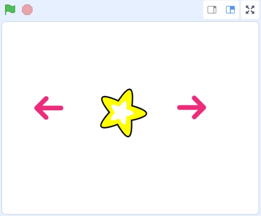

3. Interactive Sprite-Controlled Turning for the Zeus Car
======================================================================

In this lesson, we'll dive deeper into controlling the Zeus Car by learning how to program it for clockwise and counterclockwise turns. You'll also learn how to use sprites as interactive controls, enabling dynamic programming and user-friendly interaction with the Zeus Car.

This lesson builds on your knowledge of movement blocks and introduces the use of broadcast messages to manage communication between sprites and the Zeus Car.

With these new skills, you'll be able to create a more interactive and visually engaging project, bringing your Zeus Car to life in exciting ways!

.. image:: ../img/zeus_turn_left.jpg
    :width: 300

.. image:: ../img/zeus_turn_right.jpg
    :width: 300

You Will Learn
----------------------

* Program the Zeus Car to turn clockwise and counterclockwise using blocks.
* Control the Zeus Car with sprites like arrows and stars.
* Broadcast messages to coordinate actions between sprites.
* Create interactive scripts using blocks and events.

Turn Clockwise and Counterclockwise
-------------------------------------------------------------

Now let's learn how to program the Zeus Car to turn in both clockwise and counterclockwise directions. There are two blocks used for controlling rotation.

**1. "turn (Clockwise) (1) secs" Block**

* This block allows the Zeus Car to turn clockwise or counterclockwise for a specified number of seconds.

  .. image:: img/3_code_turn.png

* Drag the **"turn (Clockwise) (1) secs"** block from the **Zeus Car** category into the script area.

  .. image:: img/3_code_turn_drag.png

* Click the block, and you will see the Zeus Car turn clockwise for 1 second and then stop.

  .. image:: ../img/zeus_turn_right.jpg
      :width: 300

* You can also select "Anticlockwise". After clicking the block, the Zeus Car will turn counterclockwise for 1 second and then stop.

  .. image:: ../img/zeus_turn_left.jpg
      :width: 300

**2. "turn (Clockwise)" Block**

* This block makes the Zeus Car continuously turn in a clockwise or counterclockwise direction without stopping.

  .. image:: img/3_code_turn_no.png

* To stop the car after a specified duration, you need to add a **"wait (1) seconds"** block followed by a **"stop moving"** block.

  .. image:: img/3_code_turn_stop.png

Controlling Zeus Car Turns Using Sprites
-------------------------------------------------

In this section, you will learn how to use sprites to control the Zeus Car's clockwise and counterclockwise turns, as well as stopping its movement.

* Use two **Arrow** sprites to control the Zeus Car's clockwise and counterclockwise turns.
* Use a **Star** sprite to stop the Zeus Car's movement.

**1. Adding Arrow Sprite and Programming it**

#. Click the delete icon on the top right corner of the default sprite.

   .. image:: img/3_code_delete_sprite.png

#. Click **Choose a Sprite**.

   .. image:: img/3_code_choose_sprite.png

#. Select the **Arrow** sprite.

   .. image:: img/3_code_arrow_sprite.png

#. Rename this sprite to **Right**, and optionally adjust its size.

   .. image:: img/3_code_right.png

#. Program the Right Arrow Sprite:

   * Drag the **"when this sprite clicked"** block from the **Events** category into the script area. Program the Zeus Car to turn clockwise when the **Right Arrow** sprite is clicked.

     .. image:: img/3_code_click_sprite.png

   * Use the **"broadcast message1"** block to send a custom message. This allows other sprites to respond to the action.

     .. image:: img/3_code_right_turn.png

   * Click the dropdown menu and select **New message**.

     .. image:: img/3_code_broadcast.png

   * Finally, naming it **"right"**.

     .. image:: img/3_code_broadcast_right.png

**2. Duplicate the Arrow Sprite**

#. Long-press the **Right Arrow** sprite and select **Duplicate** to create a copy. This also copies its scripts.

   .. image:: img/3_code_arrow_copy.png

#. Rename the duplicated sprite to **Left**, and adjust its position.

   .. image:: img/3_code_arrow_left.png

#. Select the **Left Arrow** sprite, then go to the **Costumes** tab. Set its costume to **arrow1-b**.

   .. image:: img/3_code_arrow_cos_b.png

#. Modify the script so that when the **Left Arrow** sprite is clicked, the Zeus Car turns counterclockwise and broadcasts the **"left"** message.

   .. image:: img/3_code_arrow_left_message.png

**3. Adding the Star Sprite and Programming It**

Next, you'll program a **Star** sprite to control the Zeus Car's movement based on received broadcast messages, and stop its movement when clicked.

#. Choose the **Star** sprite from the library and increase its size.

   .. image:: img/3_code_star_choose.png

#. Write a script so that when the **Star** sprite is clicked, the Zeus Car stops moving.

   .. image:: img/3_code_star_sop_all.png

3. Handle Broadcast Messages:

   * Drag the **"when I receive (left)"** block from the **Events** category into the script area.

     .. image:: img/3_code_star_receive.png

   * When the **Star** sprite receives the **"left"** message, it will also rotate counterclockwise.

     .. image:: img/3_code_star_turn_left.png
   
   * Similarly, program the **Star** sprite to rotate clockwise when it receives the **"right"** message.

     .. image:: img/3_code_star_turn_right.png
   
#. Add the **"stop (other scripts in sprite)"** block to each action to prevent interference between different scripts.

   .. image:: img/3_code_start_stop_other.png

#. Adjust the sprites' positions on the stage. If the Zeus Car is successfully connected to the app, you will observe the following setup:

   * When you click the **Left** sprite, both the Zeus Car and the **Star** sprite turn counterclockwise simultaneously.
   * When you click the **Right** sprite, both the Zeus Car and the **Star** sprite turn clockwise simultaneously.
   * When you click the **Star** sprite, both the Zeus Car and the **Star** sprite stop turning.

   .. image:: img/3_code_star_arrow.png

#. Finally, remember to save this script.

**Summary**

In this lesson, you learned how to use blocks to program the Zeus Car for clockwise and counterclockwise turns. You also explored how to use sprites like **Arrow** and **Star** to control the Zeus Car's movement dynamically. With this knowledge, you can now create interactive projects and customize the behavior of your Zeus Car!
