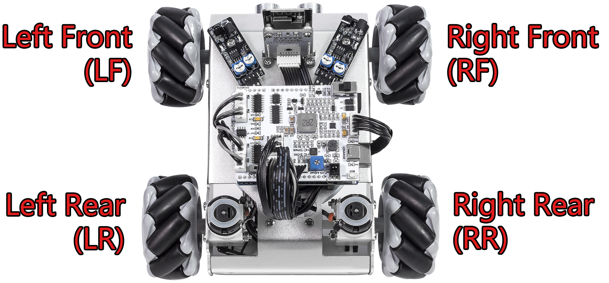
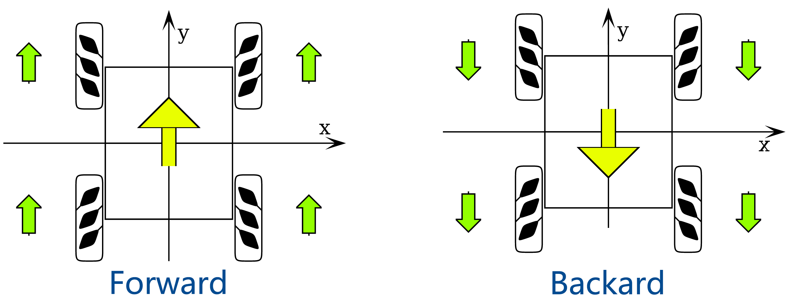
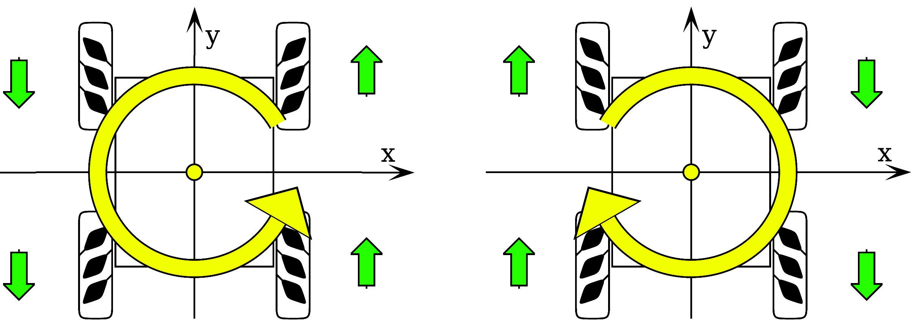
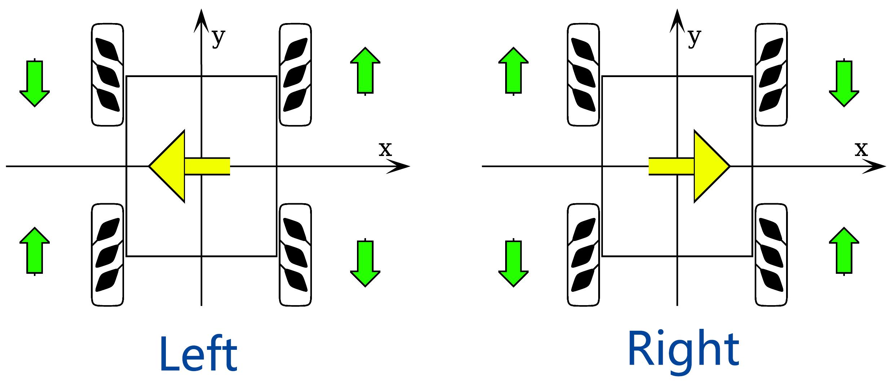
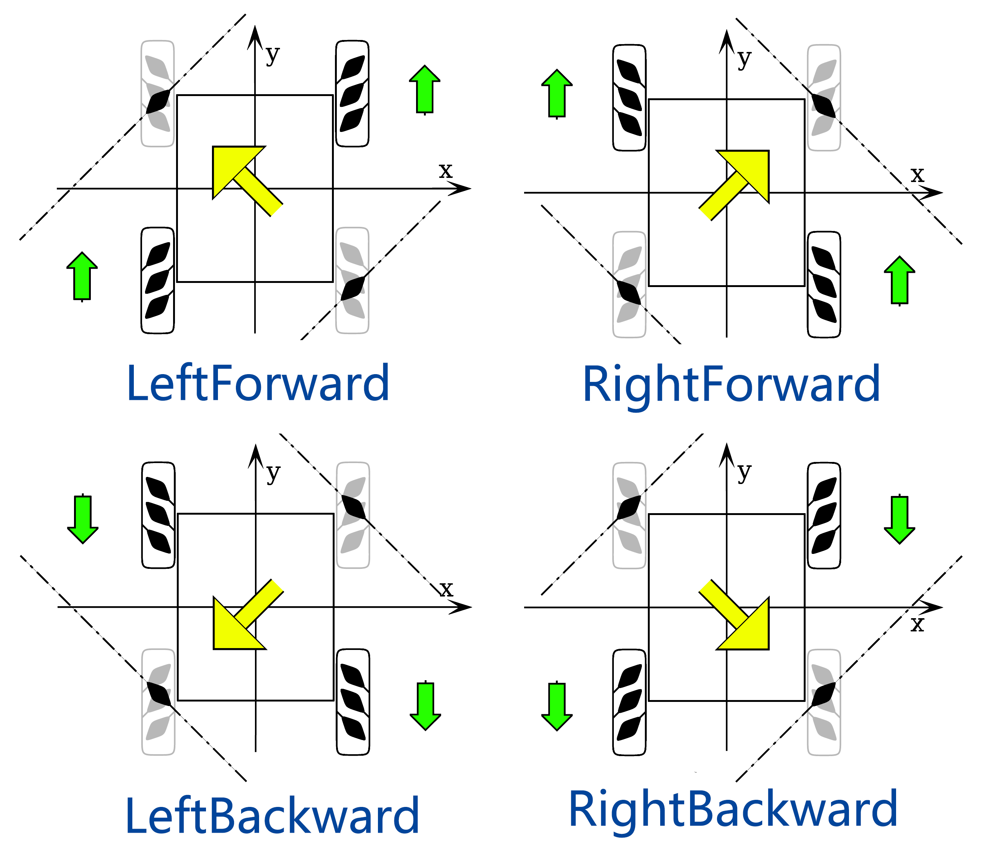

4. Understanding Mecanum Wheel Movement Principles
======================================================================

Our Zeus Car is equipped with four Mecanum wheels, enabling omnidirectional movement. In this lesson, we will explore how these wheels work together to achieve movement in various directions and rotations.

Understanding Mecanum Wheels
------------------------------------

Mecanum wheels are specially designed to allow omnidirectional movement. Each wheel has a series of rollers mounted at a 45-degree angle, which enables the car to move in any direction, including forward, backward, sideways, diagonally, and even rotate in place. By controlling the speed and direction of the four motors independently, the Zeus Car can execute complex movements.

.. image:: ../hardware/img/mecanum_wheel.png
    :width: 500
    :align: center

* **Independent Motor Control**: Each of the four Mecanum wheels is powered by a separate motor, allowing precise control of the car's movement.
* **Roller Design**: The angled rollers on the wheels create lateral forces that, when combined, produce omnidirectional movement.
* **Vector Addition**: The movement of the Zeus Car is the result of vector addition of the forces generated by each wheel.

Set the Speed of Each Motor
--------------------------------------------------

The Zeus Car uses four motors to control its four Mecanum wheels:

The block "move at LF(50) LR(50) RF(50) RR(50) for (1) secs" allows you to independently set the speed of each motor:

* ``LF (50)``: Sets the Left Front motor speed to 50%.
* ``LR (50)``: Sets the Left Rear motor speed to 50%.
* ``RF (50)``: Sets the Right Front motor speed to 50%.
* ``RR (50)``: Sets the Right Rear motor speed to 50%.

Steps to Use the Block:

#. Drag the block from the **Zeus Car** category into the script area.

   .. image:: img/4_code_drag_forward.png

#. Click the block, and you'll observe the Zeus Car moving forward.

#. The "move at LF(50) LR(50) RF(50) RR(50)" block performs the same function but without a time parameter, meaning the Zeus Car will not stop after moving. To stop the Zeus Car after a specific duration, use the block without a time parameter and add a **"wait (1) seconds"** block followed by a **"stop moving"** block.

  .. image:: img/4_code_move_stop.png

Exploring Omnidirectional Movement
---------------------------------------------

Now, let's explore how the four Mecanum wheels work together to enable movement in all directions.

**1. Moving Forward and Backward**

* **Forward Movement**: Set all four motors to positive speeds.
  
  .. image:: img/4_code_forward.png
    :width: 600

* **Backward Movement**: Set all four motors to negative speeds.
  
  .. image:: img/4_code_backward.png
    :width: 600

**2. Rotating Clockwise and Counterclockwise**

* **Counterclockwise Rotation**: Set the Left Front (LF) and Left Rear (LR) motors to negative speeds, and the Right Front (RF) and Right Rear (RR) motors to positive speeds.
  
  .. image:: img/4_code_rotate_ccw.png
    :width: 600

* **Clockwise Rotation**: Set the Left Front (LF) and Left Rear (LR) motors to positive speeds, and the Right Front (RF) and Right Rear (RR) motors to negative speeds.
  
  .. image:: img/4_code_rotate_cc.png
    :width: 600

**3. Moving Left and Right**

* **Left Movement**: Set the Left Front (LF) and Right Rear (RR) motors to negative speeds, and the Right Front (RF) and Left Rear (LR) motors to positive speeds.
  
  .. image:: img/4_code_move_left.png
    :width: 600

* **Right Movement**: Set the Left Front (LF) and Right Rear (RR) motors to positive speeds, and the Right Front (RF) and Left Rear (LR) motors to negative speeds.
  
  .. image:: img/4_code_move_right.png
    :width: 600

**4. Diagonal Movement**

Diagonal movement only requires two motors to work together:

* **Left Forward**: Set Right Front (RF) and Left Rear (LR) motors to positive speeds, with the other two motors set to 0.
  
  .. image:: img/4_code_left_up.png
    :width: 600

* **Right Backward**: Set Right Front (RF) and Left Rear (LR) motors to negative speeds, with the other two motors set to 0.
  
  .. image:: img/4_code_right_back.png
    :width: 600

* **Right Forward**: Set Left Front (LF) and Right Rear (RR) motors to positive speeds, with the other two motors set to 0.
  
  .. image:: img/4_code_right_forward.png
    :width: 600

* **Left Backward**: Set Left Front (LF) and Right Rear (RR) motors to negative speeds, with the other two motors set to 0.
  
  .. image:: img/4_code_left_back.png
    :width: 600

**5. Drifting**

If you want the Zeus Car to perform a drifting effect, how should you set the speeds of the four motors?

* **Drifting Left**: 

  .. image:: img/4_motor_drift_left.jpg
    :width: 400
    :align: center

  Set the Left Front (LF) and Right Front (RF) motors to 0. Set the Left Rear (LR) motor speed to a positive value, and the Right Rear (RR) motor speed to a negative value.
  
  .. image:: img/4_code_move_drift_left.png
    :width: 600

* **Drifting Right**: 

  .. image:: img/4_motor_drift_right.jpg
    :width: 400
    :align: center
    

  Set the Left Front (LF) and Right Front (RF) motors to 0. Set the Left Rear (LR) motor speed to a negative value, and the Right Rear (RR) motor speed to a positive value.

  .. image:: img/4_code_move_drift_right.png
    :width: 600

Moving in a Circular Path
----------------------------------

Previously, we set motor speeds to the same values to move in straight lines or rotations. Now, let's explore how adjusting motor speeds can create new movement patterns, like moving in a circular path.

To make the Zeus Car move in a circle, we need to create a difference in speed between the left and right motors. This causes the car to turn continuously, tracing a circular path.

**Summary**

In this lesson, you explored the mechanics of Mecanum wheels and how they allow the Zeus Car to achieve omnidirectional movement. You learned:

* How to use blocks to control the speed of each motor independently.
* The principles behind forward, backward, diagonal, and rotational movements.
* How to combine motor speeds for circular path.

By mastering these concepts, you can now control the Zeus Car with precision and creativity, unlocking endless possibilities for advanced programming and navigation challenges!
