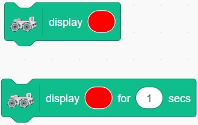
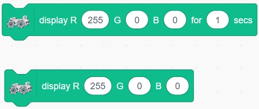
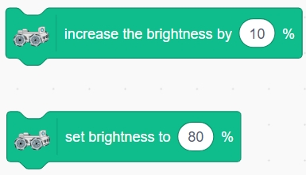
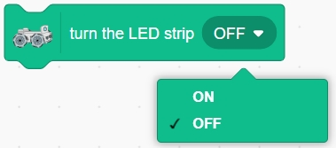
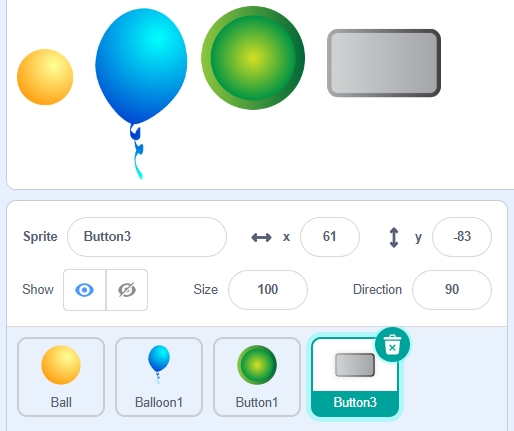

6. Lighting the Way with RGB LED Strips
===============================================================

In this lesson, we will learn how to control the RGB LED strips on the Zeus Car using the Mammoth Coding App. We'll explore how to change colors, adjust brightness, and use the LED strips as signal indicators to enhance our projects.

You Will Learn
-------------------

* **Control the RGB LED strips** on the Zeus Car using different blocks in the Mammoth Coding App.
* **Change colors**, adjust **brightness**, and **toggle** the LED strips on and off.
* **Use the LED strips as signal indicators** to reflect the Zeus Car's movement directions or connection status.
* **Integrate LED control with movement scripts**, enhancing the interactivity and feedback of your projects.

About 4 RGB LEDs Strip
-----------------------------------

.. image:: ../hardware/img/4_rgb_strip.jpg
   :width: 500
   :align: center

The RGB strip is composed of 4 RGB LEDs and has the ability to produce any shade of any color, it is a mixture of three primary colors; red, blue and green. 

The RGB LEDs used are 5050, connected in a common anode way. Each LED is an independent circuit, can be cut along the switch at will, without damaging other parts. Made of FPC board, backed with double-sided adhesive, can be bent and secured at will.

* :ref:`cpn_rgb_strip`

Light Up the RGB Strips
------------------------------

The Zeus Car has two RGB LED strips at the bottom that can display various colors. Let's learn how to use different blocks to control these LED strips.

   .. image:: img/6_code_light_all.png

**1. display (color) block or display (color) block for (1) secs**

These two blocks function similarly and are used to set the color of the LED strips. The block with the time parameter allows you to specify how long the color is displayed.

#. Delete the default sprite to start with a clean slate. Then select the **Ball** sprite from the sprite library.

   .. image:: img/6_code_light_ball.png

3. Add the display color block:

   * From the **Zeus Car** category, drag out the **"display (color) for (1) secs"** block.
   * Click on the color area of the block to open the color picker.
   * Adjust the **Color**, **Saturation**, and **Brightness** sliders to choose the color you want.

   .. note::

      Try to avoid adjusting **Saturation** and **Brightness** to prevent discrepancies between the displayed colors on the light strip and the ones you set.

   .. image:: img/6_code_light_select_color.png

#. You can also use the eyedropper tool to select a color from any sprite on the stage.

   .. image:: img/6_code_light_xi_color.png

#. Add the **"when this sprite clicked"** block from the **Events** category.

   .. image:: img/6_code_light_click_ball.png

#. When you click on the **Ball** sprite on the stage, the Zeus Car will display the color you set for 1 second.

**2. "display R (255) G (0) B (0)"" Block or "display R (255) G (0) B (0) for (1) secs" Block**

When you know the RGB values of a color, you can input them directly into these blocks. The block with the time parameter allows you to specify the duration the color is displayed.

#. Click on **"Choose a Sprite"** and select the **Balloon1** sprite.

   .. image:: img/6_code_light_balloon.png

#. From the **Zeus Car** category, drag out the **"display R (255) G (0) B (0) for (1) secs"** block. Set the RGB values to display blue (e.g., R: 0, G: 0, B: 255).

   .. image:: img/6_code_light_set_blue.png

#. Add the **"when this sprite clicked"** block.

   .. image:: img/6_code_light_click_balloon.png

#. When you click on the **Balloon1** sprite on the stage, the Zeus Car will display the blue color you set for 1 second.

**3. "Increase the Brightness by (10)%" and "Set Brightness to (80)%" Blocks**

* **"Increase the brightness by (10)%"**: Adjusts the brightness of the RGB LED strips. Positive values increase brightness; negative values decrease brightness.
* **"Set brightness to (80)%"**: Sets the brightness of the RGB LED strips to a specific percentage between 0% and 100%.

#. Select the **Button1** sprite from the sprite library.

   .. image:: img/6_code_light_button.png

#. When the green flag is clicked, have the Zeus Car display red and set the brightness to 100%.

   .. image:: img/6_code_light_100.png

#. When the **Button1** sprite is clicked, decrease the brightness by -10% (which reduces brightness).

   .. image:: img/6_code_brightness_decrease.png

#. Clicking on the **Button1** sprite will decrease the brightness of the LED strips by 10% each time.

**4. "Turn the LED Strip (on/off)" Block**

This block is used to turn the RGB LED strips on or off.

#. Select the **Button3** sprite from the sprite library.

   .. image:: img/6_code_button3.png

#. When the green flag is clicked:

   * Turn the LED strips **on** using the **"turn the LED strip (on)"** block.
   * Switch the **Button3** sprite's costume to **button3-b** to indicate the "on" state.

   .. image:: img/6_code_light_turn_on.png

#. When the **Button3** sprite is clicked, it will switch costumes between **"button3-a"** and **"button3-b"**.

   .. image:: img/6_code_camera_switch.png

#. Use an **"if...else"** block to check the **"costume number"**.
   
   * If the **"costume number"** is **1** (which corresponds to **"button3-a"**), turn the LED strips **OFF**.
   * If the **"costume number"** is **2** (which corresponds to **"button3-b"**), turn the LED strips **ON**.

   .. image:: img/6_code_light_turn_off.png

#. Clicking on the **Button3** sprite will toggle the LED strips on and off.

Now, run the script and click on each sprite to control the Zeus Car's bottom LED strips—setting colors, adjusting brightness, and turning them on or off. After testing, don't forget to save your script.

Using LED Strips as Signal Lights in Action
--------------------------------------------------

The RGB LED strips can also be used as signal indicators. For example, they are pre-set to indicate the connection status between the Mammoth Coding App and the Zeus Car:

* **Flashing yellow** indicates no devices are connected.
* **Steady blue** means the connection is successful.

Now let's set them up as movement indicator lights for the Zeus Car:

* **When moving forward**, display **green**.
* **When moving backward**, display **red**.
* **When moving left or right**, display **yellow**.

Here are steps to implement movement tndicator lights:

#. When the green flag is clicked, set the Zeus Car's movement speed to **100%**.

   .. image:: img/6_code_move_speed.png

#. Use the **"when [key] key pressed"** event blocks to control the Zeus Car's movement with the arrow keys.

   * **Up Arrow Key**: Move in the **0-degree** direction (forward).
   * **Down Arrow Key**: Move in the **180-degree** direction (backward).
   * **Left Arrow Key**: Move in the **-90-degree** direction (left).
   * **Right Arrow Key**: Move in the **90-degree** direction (right).

   .. image:: img/6_code_move_arrow.png
      :width: 700

#. For each movement direction, add a block to display the corresponding color:

   * **Moving Forward**: Display **green**.
   * **Moving Backward**: Display **red**.
   * **Moving Left or Right**: Display **yellow**.

   .. image:: img/6_code_move_color.png
      :width: 700
   
#. Add the **"stop other scripts in this sprite"** block at the beginning of each movement script to prevent interference between them.

   .. image:: img/6_code_move_stop.png
      :width: 700

#. After completing the scripts, you can expand the stage by clicking the full-screen button if desired.

   .. image:: img/2_code_expand.png

#. Test the script:

   * Click the green flag to set the Zeus Car's movement speed.
   * Use the arrow keys to control the movement of the Zeus Car.
   * Observe that the LED strips display the corresponding colors as the car moves.

   .. image:: img/2_code_control.png
      :width: 600

**Summary**

In this lesson, you learned how to control the RGB LED strips on the Zeus Car using the Mammoth Coding App. By exploring different blocks in the Zeus Car category, you now know how to change colors, adjust brightness, and turn the LED strips on or off. Additionally, you integrated LED control with movement scripts, using the LED strips as signal indicators to reflect the car's movements or connection status. This enhances the interactivity and visual appeal of your projects, making the Zeus Car more engaging and responsive.

