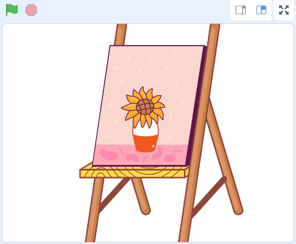

7. Exploring the Ultrasonic Sensor
===============================================

In this lesson, we'll delve into the functionalities of the ultrasonic sensor and learn how to implement obstacle avoidance using the Zeus Car.

You Will Learn
-------------------

In this lesson, you learned how to:

* Understand the principles of ultrasonic distance measurement.
* Program the Zeus Car to utilize the ultrasonic sensor for obstacle detection.
* Implement a basic obstacle avoidance script using control structures and movement blocks.

About Ultrasonic Module
-------------------------------

.. image:: ../hardware/img/ultrasonic_pic.png
    :width: 300
    :align: center

This is the HC-SR04 ultrasonic distance sensor, providing non-contact measurement from 2 cm to 400 cm with a range accuracy of up to 3 mm. Included on the module is an ultrasonic transmitter, a receiver and a control circuit.

You only need to connect 4 pins: VCC (power), Trig (trigger), Echo (receive) and GND (ground) to make it easy to use for your measurement projects.

* :ref:`cpn_ultrasonic`

Reading Distance Values
-------------------------------------------------------

Let's learn how to read distance measurements using the Mammoth Coding App.

#. Find the **"distance in cm"** block under the **Zeus Car** category. Check the checkbox next to it to display its value on the stage.

   .. image:: img/7_code_ultrasonic_value.png

#. The value of the ultrasonic sensor will now appear on the stage in real-time.

   .. image:: img/7_code_value_stage.png

#. Move your hand back and forth in front of the ultrasonic sensor. Observe how the displayed distance changes according to the distance between your hand and the sensor (measured in centimeters).

Creating an Interactive Animation
----------------------------------------------

Let's create a fun animation where a vase on an easel displays more flowers when your hand is at a certain distance from the ultrasonic sensor.

#. Delete the default sprite to start with a clean slate. Click on **"Choose a Sprite"** to add a new one.
   
   .. image:: img/7_code_picture_choose.png

#. Choose the **"Easel"** sprite from the library.

   .. image:: img/7_code_picture_easel.png

#. Position the easel at the center of the stage. Set its size to **200** for better visibility.
   
   .. image:: img/7_code_picture_size.png

#. Now, let's start coding the sprite. When the green flag is clicked, we'll use the **"if...else"** block from the **Control** category to check the current distance measured by the ultrasonic sensor.

   * **"if...else" Block**: This is a conditional block that allows you to execute different scripts based on whether a condition is true or false. If the condition after "if" is true, the script inside the "then" section runs; otherwise, the script inside the "else" section runs.

   .. image:: img/7_code_picture_if.png

#. We want the vase to display four flowers when the ultrasonic sensor detects a distance between 10 cm and 15 cm. To check this condition, we'll use the **"and"** block from the **Operators** category.

   * **"and" Block**: This logical operator checks if both conditions are true. It outputs **true** only if both conditions are met.

   .. image:: img/7_code_picture_and.png
      :width: 800

#. Place the "and" block inside the condition slot of the **"if...else"** block.

   .. image:: img/7_code_picture_and_if.png
      :width: 800

8. Configure the costumes based on the condition:

   * **If** the ultrasonic sensor detects a distance between 10 cm and 15 cm: Switch the **Easel** sprite to **Costume C** (displaying four flowers).
   * **Else**: Keep the sprite on **Costume B** (displaying one flower).

   .. image:: img/7_code_picture_then_else.png
      :width: 800

9. Finally, use the **"forever"** block to ensure the script runs continuously, constantly checking the distance and updating the sprite accordingly.

   .. image:: img/7_code_picture_forever.png
      :width: 800

10. Now run the script and place your hand in front of the ultrasonic module. Check if the vase displays 4 flowers when the distance is between 10-15 cm. Once the test is successful, don't forget to save the script.

   .. image:: img/7_code_picture.png

Implementing Obstacle Avoidance
--------------------------------------------------------

Now, let's apply the ultrasonic sensor to make the Zeus Car avoid obstacles.

#. When the script starts, set the Zeus Car's speed to 50% and make it continuously move forward at 0 degrees.

   .. image:: img/7_code_avoid_speed.png

#. Program the Zeus Car to move forward continuously at **0 degrees**.

   .. image:: img/7_code_avoid_move.png

#. Use an **"if then"** block to check if the current distance measured by the ultrasonic sensor is less than **15 cm**.

   .. image:: img/7_code_avoid_if.png

#. If the condition is true, perform the following actions:

   * **Stop Moving**: Use the **"stop moving"** block.
   * **Move Backward**: Move at **180 degrees** (backward) for **1 second**.
   * **Rotate**: Turn **clockwise** for **0.3 seconds**.

   .. image:: img/7_code_avoid_back.png

   
#. Finally, add a **0.1-second delay** to prevent the script from executing too rapidly, which can cause performance issues or erratic behavior in the Zeus Car.

   .. image:: img/7_code_avoid_wait.png

#. Now run the script and check if the Zeus Car can avoid obstacles and move forward. Once the test is successful, don't forget to save the script.

**Summary**

By enhancing the obstacle avoidance behavior, we've made the Zeus Car more intelligent and capable of navigating around obstacles rather than simply retreating. This more flexible approach demonstrates how sensor data and programming logic can be combined to create sophisticated robotics applications.

The possibilities are vast—keep exploring and pushing the boundaries of what your Zeus Car can do!