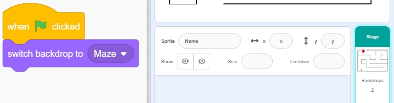

.. note::

    Hello, welcome to the SunFounder Raspberry Pi & Arduino & ESP32 Enthusiasts Community on Facebook! Dive deeper into Raspberry Pi, Arduino, and ESP32 with fellow enthusiasts.

    **Why Join?**

    - **Expert Support**: Solve post-sale issues and technical challenges with help from our community and team.
    - **Learn & Share**: Exchange tips and tutorials to enhance your skills.
    - **Exclusive Previews**: Get early access to new product announcements and sneak peeks.
    - **Special Discounts**: Enjoy exclusive discounts on our newest products.
    - **Festive Promotions and Giveaways**: Take part in giveaways and holiday promotions.

    👉 Ready to explore and create with us? Click [|link_sf_facebook|] and join today!

4. Eat Apple
======================

In this project, we use an infrared obstacle avoidance module to guide the Beetle sprite to an apple.

After clicking the green flag, swiftly pass your hand over the left obstacle avoidance module (block and quickly remove your hand from in front of the module) to initiate Beetle's rotation. Once it aligns properly, sweep your hand over the module again to move Beetle forward, ensuring it avoids the black lines on the map. If adjustments or turns are necessary, swipe your hand over the module again to rotate Beetle to the desired angle. Repeat these steps until the Beetle sprite reaches the apple.

.. raw:: html

   <video loop autoplay muted style = "max-width:70%">
      <source src="../_static/video/sc_eat_apple.mp4" type="video/mp4">
      Your browser does not support the video tag.
   </video>

Below are the steps for implementing the project. It's recommended to follow these initially, and once familiar, you may modify the effects as you wish.

1. Draw the **Maze** Backdrop
-------------------------------------

Here, we will draw a map backdrop with a red apple on it.

* First, select a blank backdrop.

  .. image:: img/apple_click_backdrop.png

* Click **Backdrops** to start drawing the map backdrop. First, rename the backdrop to **Maze**.

  .. image:: img/apple_open_backdrop.png

* Use the **Line** tool, set the color to black, width to 4, and start drawing the map. You can design your map based on your ideas; it doesn't have to be like mine.

  .. image:: img/apple_paint_bk_maze2.png
    :width: 90%

* Now, draw an apple. Using the **Circle** tool, draw an ellipse or circle in red with no outline.

  .. image:: img/apple_paint_bk_maze3.png

  .. note::

    You can remove the outline by clicking the **Outline** window and then using the **Remove** tool.

    .. image:: img/apple_paint_bk_maze4.png

* Select the **Brush** tool and choose a color and width to finish drawing the apple.

  .. image:: img/apple_paint_bk_maze5.png

2. Draw the **Win** Backdrop
---------------------------------

Now start drawing; refer to the steps below, or draw your backdrop based on your creativity, ensuring it represents a victory.

* Click the button to add a new backdrop at the bottom, select **Paint**, and name this backdrop **Win**.

  .. image:: img/apple_paint_bk_win.png

* Using the **Circle** tool, draw an ellipse in red with no outline.

  .. image:: img/apple_paint_bk_win2.png
    :width: 90%

* Then, use the **Text** tool to write "WIN!". Set the font color to black and adjust the size and position of the text.

  .. image:: img/apple_paint_bk_cus2.png
    :width: 90%

3. Scripting for the **Maze** Backdrop
--------------------------------------

Ensure the backdrop is switched to **Maze** every time the game starts.

4. Select the **Beetle** Sprite
-----------------------------------------

* Delete the default sprite and select the **Beetle** sprite.

  .. image:: img/apple_choose_sprite.png

* Place the **Beetle** sprite at the entrance of the **Maze** backdrop, noting the x, y coordinate values at this point, and resize the sprite to 40%.

  .. image:: img/apple_place_sprite.png

5. Scripting for the **Beetle** Sprite
-----------------------------------------------

Now, write a script for the **Beetle** sprite to move forward and change direction under the control of the left obstacle avoidance module.

* When the green flag is clicked, set the **Beetle** angle to 90, and the position to (-124, -113), or use the coordinate values of your placement.

  .. image:: img/apple_point_in.png
    :width: 90%

* Create the variable **flag** and set its initial value to -1.

  .. image:: img/apple_vable_flag.png

Next, within the [forever] block, use four [if] blocks to manage different scenarios.

* If the left infrared is blocked, use the [`mod <https://en.scratch-wiki.info/wiki/Boolean_Block>`_] block to toggle the variable **flag** between 0 and 1 (alternating between 0 for this press and 1 for the next).

   .. image:: img/apple_read_ir.png

* If the flag is 0 (left infrared is blocked), let the **Beetle** sprite turn clockwise. If the flag is 1 (left infrared is blocked again), the **Beetle** moves forward. Otherwise, it continues turning clockwise.

  .. image:: img/apple_read_flag.png

* If the **Beetle** sprite touches black (the black line on the **Maze** backdrop), the game ends, and the script stops running.

  .. image:: img/apple_touch_black1.png

  .. note::
    
    Click on the color area in the [Touch color] block and select the eyedropper tool to pick up the color of the black line on the stage. If you choose a random black, this [Touch color] block will not function correctly.

    .. image:: img/apple_touch_black.png

* If the Beetle touches red (also use the straw tool to pick up the red color of the apple), the backdrop switches to **Win**, indicating the game is successful, and the script stops running.

  .. image:: img/apple_touch_red.png

Programming complete, you can now click the green flag to run the script and see if it achieves the desired effect.

  .. raw:: html

    <video loop autoplay muted style = "max-width:70%">
        <source src="../_static/video/sc_eat_apple.mp4"  type="video/mp4">
        Your browser does not support the video tag.
    </video>